<link rel="stylesheet" href="教材.css">

<div class="cover">
  
  <p class="cover-label">基本情報技術者試験　科目B対策</p>
  <h1>擬似言語とAIで学ぶ<br>アルゴリズム入門</h1>
  <p class="cover-subtitle">はじめての変数から、配列のトレースまで</p>
  <div class="cover-rule"></div>
  <p class="cover-message">「答えを聞く」のではなく、<br>「分からない場所を見つける」ためにAIを使おう。</p>
  <p class="edition">基本情報技術者試験　科目B対策教材</p>
</div>

<div class="page-break"></div>

# はじめに

この教材は、基本情報技術者試験の科目Bで出題されるアルゴリズムとプログラミングを、プログラミング未経験者が擬似言語から学ぶための入門書です。

科目Bの問題を解くために、難しいプログラム言語を最初から覚える必要はありません。まず必要なのは、次の三つの力です。

1. 擬似言語を上から順番に読む力
2. 変数や配列の値がどう変化するかを追う力
3. 分からない箇所を言葉にして、質問する力

本研修では、処理の基本となる**順次・選択・繰返し**を擬似言語で学びます。各演習の解説には、処理の進み方を矢印で示すフローチャートも掲載します。コードの一行と図の一つの処理を対応させて読みましょう。

また、本研修では生成AIへ質問するための例文を紹介します。AIに正解を直接聞くのではなく、考え方の整理、ヒント、トレースの確認、間違いの発見に利用します。

<div class="goal-box">
  <p class="box-title">本研修の到達目標</p>
  <ul>
    <li>変数・代入・配列を説明できる</li>
    <li>選択処理と繰返し処理を読める</li>
    <li>短い擬似言語をトレースできる</li>
    <li>合計・件数・最大値を求める処理を理解できる</li>
    <li>AIを使って、自分で学習を続けられる</li>
  </ul>
</div>

## この教材の使い方

第0章は、全員が最初に学ぶ「AIの安全で有効な活用」です。第1〜8章には各6問（★を2問、★★を2問、★★★を2問）、合計48問を用意しています。

| 難易度 | 取り組み方 |
|---|---|
| ★☆☆ 基礎 | 一つの処理・値・条件を確認する |
| ★★☆ 応用 | 複数の処理を組み合わせ、途中の値を説明する |
| ★★★ 実践 | 仕様や利用場面を読み、境界や処理順も検証する |

早く終わった人は上の難易度へ進み、条件や入力を変えても説明できるか確かめます。

各節は、次の順番で進みます。

<div class="learning-cycle">
  <div><span>1</span><strong>概念を読む</strong><small>何をする仕組みか理解する</small></div>
  <div><span>2</span><strong>処理をたどる</strong><small>値が変わる順番を手で記録する</small></div>
  <div><span>3</span><strong>自力で解く</strong><small>最初からAIに聞かない</small></div>
  <div><span>4</span><strong>AIに質問する</strong><small>分からない箇所だけ尋ねる</small></div>
  <div><span>5</span><strong>解き直す</strong><small>AIを閉じてもう一度解く</small></div>
</div>

<div class="important-box">
  <p class="box-title">大切なルール</p>
  <p>AIの説明は、いつも正しいとは限りません。本研修の解説や公式資料と照合し、自分で値を追って確認してください。「AIが言ったから正しい」ではなく、「自分でも同じ結果を確認できたから正しい」と判断します。</p>
</div>

<div class="toc-box">

## 目次

<ol class="toc-list">
  <li><a href="#chapter-0"><span>第0章　AIを学習相手にする</span><b>5</b></a></li>
  <li><a href="#chapter-1"><span>第1章　アルゴリズムと擬似言語</span><b>11</b></a></li>
  <li><a href="#chapter-2"><span>第2章　変数・データ型・代入</span><b>20</b></a></li>
  <li><a href="#chapter-3"><span>第3章　順次処理</span><b>31</b></a></li>
  <li><a href="#chapter-4"><span>第4章　選択処理</span><b>39</b></a></li>
  <li><a href="#chapter-5"><span>第5章　繰返し処理</span><b>49</b></a></li>
  <li><a href="#chapter-6"><span>第6章　配列</span><b>60</b></a></li>
  <li><a href="#chapter-7"><span>第7章　トレースの技術</span><b>70</b></a></li>
  <li><a href="#chapter-8"><span>第8章　総合演習</span><b>79</b></a></li>
  <li><a href="#answers"><span>解答・解説</span><b>87</b></a></li>
  <li><a href="#roadmap"><span>研修後の学習ロードマップ</span><b>136</b></a></li>
</ol>

</div>

<div class="page-break"></div>

<a id="chapter-0"></a>

# 第0章　AIを学習相手にする

## 最初に確認：AIを安全に、有効に使う

この章は演習より先に学びます。AIを使い慣れていても、安全のルールと学習に役立つ質問方法を確認してください。

| 確認すること | 研修での行動 |
|---|---|
| 個人情報・機密情報 | 氏名、連絡先、顧客情報、社内資料、パスワードは入力しません。必要な例は架空の名前・数値に置き換えます。 |
| 利用する場所 | 講師が指定した共有ノートブックを使い、会社・研修の利用ルールを守ります。リンクを研修外へ転送しません。 |
| 回答の正しさ | AIの説明はもっともらしくても誤ることがあります。参照元を開き、自分のトレースと教材の解説で確かめます。 |
| 学習の目的 | まず自分で考え、ヒントを一つずつ求めます。最後はAIを閉じて解き直します。 |

**安全確認の例：**「顧客Aさんの実際の購入履歴」ではなく、「架空の購入額が1000円の場合」として質問します。学習に必要のない実データは渡しません。

## 0.1 AIは「正解を出す機械」ではない

生成AIへ問題をそのまま入力し、「答えを教えて」と頼めば、短時間で答えらしきものが表示されます。しかし、それだけでは自分で問題を解く力は身に付きません。

本研修では、AIを次の四つの役割で使います。

| AIの役割 | 何をしてもらうか | 使用する場面 |
|---|---|---|
| 整理役 | 入力・処理・出力を分ける | 問題文の意味が分からない |
| ヒント役 | 次に見るべき場所を示す | 解き始められない |
| 点検役 | 最初に間違えた箇所を示す | 自分の考えに自信がない |
| 練習相手 | 難易度を調整した類題を作る | もう一問練習したい |

<div class="ng-box">
  <p class="box-title">避けたい質問</p>
  <p>問題番号を示さずに「答えを教えて」とだけ頼むことや、考える前に「完成した擬似言語を作って」と頼むこと</p>
  <p class="box-caption">正解だけを受け取ると、どこで考えられなくなったのかが分かりません。</p>
</div>

<div class="ok-box">
  <p class="box-title">学習につながる質問</p>
  <p>「最初に確認すべき変数を一つ教えてください」</p>
  <p>「私のトレース表で、最初に間違っている行だけを指摘してください」</p>
</div>

## 0.2 AIに質問する前の30秒

質問を入力する前に、次の三点を書き出します。

<div class="thinking-sheet">
  <p class="sheet-title">AIへ聞く前の整理メモ</p>
  <div><span>1</span><strong>分かっていること</strong><i>ここに書く</i></div>
  <div><span>2</span><strong>分からないこと</strong><i>ここに書く</i></div>
  <div><span>3</span><strong>自分で試したこと</strong><i>ここに書く</i></div>
</div>

例えば、次のように書きます。

<div class="thinking-sheet filled">
  <p class="sheet-title">記入例</p>
  <div><span>1</span><p><strong>分かっていること</strong>totalが合計を保存する変数であることは分かります。</p></div>
  <div><span>2</span><p><strong>分からないこと</strong><code>total ← total ＋ A[i]</code>の右辺で、どの値を使うのか分かりません。</p></div>
  <div><span>3</span><p><strong>自分で試したこと</strong>iが1の場合までは表に書きました。</p></div>
</div>

ここまで書くと、AIへの質問が具体的になります。また、自分がどこまで理解できているかも見えるようになります。

## 0.3 研修中：共有ノートブックへ問題番号で質問する

今回の研修では、講師が本研修のPDFを読み込ませたGemini Notebook（NotebookLM）のリンクを共有します。受講者が問題文をコピーして貼り付けたり、PDFを再アップロードしたりする必要はありません。講師から届いたリンクで対象ノートブックを開き、そのチャット欄に質問します。

1. 共有リンクを開き、研修用のノートブックであることを確認する。
2. 「問題2-Bについて質問です。」のように、章番号と問題の英字を指定する。
3. 自分が分かっていること、試したこと、分からない点を書く。

答えや完成コードをすぐに示さない設定は、講師が済ませています。各問題への質問では、その指示を繰り返す必要はありません。

<div class="ai-box">
  <p class="ai-label">研修中の質問例｜問題番号と疑問点を伝える</p>
  <p>問題2-Bについて質問です。xにyを入れるところは分かりますが、tempが必要な理由が分かりません。</p>
</div>

## 0.4 研修後：別の参考書の問題をAIへ伝える

自習では、質問したい問題をAIへ渡します。資料とAIの機能に合わせ、次の三つの方法から選びます。

<div class="input-methods">
  <div>
    <span class="method-number">1</span>
    <strong>文章をコピーして貼る</strong>
    <small>WebページやPDFで文字を選択できる場合</small>
  </div>
  <div>
    <span class="method-number">2</span>
    <strong>写真・スクリーンショットを添付する</strong>
    <small>紙のテキスト、図・表・擬似言語を含む問題の場合</small>
  </div>
  <div>
    <span class="method-number">3</span>
    <strong>必要な部分を手で入力する</strong>
    <small>コピーも画像添付もできない場合</small>
  </div>
</div>

### 方法1　問題文をコピーして貼り付ける

問題文、擬似言語、選択肢をまとめてコピーし、質問の前に貼り付けます。長い問題では、次の見出しを付けるとAIが内容を区別しやすくなります。

<div class="copy-template">
  <p class="template-title">AIへ貼り付ける形</p>
  <div><strong>問題文</strong><span>ここに問題文を貼る</span></div>
  <div><strong>擬似言語</strong><span>ここに擬似言語を貼る</span></div>
  <div><strong>選択肢</strong><span>ここに選択肢を貼る</span></div>
  <div><strong>自分が分からないところ</strong><span>例：3行目で、totalにどの値が入るのか分からない</span></div>
</div>

### 方法2　紙のテキストを撮影する／スクリーンショットを添付する

紙のテキストは、問題全体が読めるように写真を撮ってアップロードします。WebページやPDFでは、スクリーンショットを添付できます。どちらも問題文、擬似言語、選択肢が途中で切れないようにしてください。影や手で文字が隠れないようにし、複数ページなら順番に添付します。

<div class="important-box">
  <p class="box-title">画像を添付したら、最初に読み取り確認をする</p>
  <p>AIは、画像内の添字、記号、数字を読み間違えることがあります。すぐに解かせず、「画像から読み取った問題文と擬似言語をそのまま書き出してください」と頼み、元画像と見比べます。</p>
</div>

### 方法3　必要な部分を手で入力する

画像を添付できない場合は、問題の条件と擬似言語を入力します。すべてを打ち直すのが大変なら、分からない行と、その行で使う変数の初期値だけでも構いません。

<div class="problem-packet">
  <p class="box-title">AIへ送る順番</p>
  <div><span>問題を渡す</span><b>→</b><span>読み取りを確認する</span><b>→</b><span>分からない点を書く</span><b>→</b><span>ヒントを頼む</span></div>
</div>

## 0.5 自習での質問は「最初の設定」と「問題ごとの質問」に分ける

研修中は、Gemini Notebookの出力カスタマイズにより、答えや完成コードを見せない設定が済んでいます。そのため、0.3の手順で問題番号と質問内容を送るだけで構いません。

研修後に別の参考書で自習するときは、チャットを始めた直後に**最初の設定**を一度だけ送ります。同じチャットを続ける間は、毎回繰り返す必要はありません。新しいチャットを始めたときだけ、もう一度設定します。

### 手順1　新しいチャットの最初に、学習方法を設定する

<div class="ai-box">
  <p class="ai-label">最初の設定として送る文</p>
  <p>あなたはプログラミング未経験者の学習支援者です。問題について、正解や完成した擬似言語はすぐには示さず、ヒントや問いかけを通じて私が自力で考えられるように分かりやすくガイドしてください。私が考え方を説明したときは、どこに誤りがあるかや、次に確認すべきポイントを親切にアドバイスしてください。</p>
</div>

### 手順2　問題ごとに、質問したいことを送る

問題を0.4の方法で渡した後、分かっていること・試したこと・分からない点を添えて質問します。自分で書いた解答やトレース表は、画像または文章で追加します。

<div class="ai-box">
  <p class="ai-label">問題ごとに質問するとき</p>
  <p>添付した問題について質問です。<code>total ← total ＋ A[i]</code>の計算で、右辺の値がどう決まるのかが分かりません。iが1の場合まではトレース表に書きました。次にどこに着目すればよいか、ヒントを教えてください。</p>
</div>

### 発展　同じ考え方で解ける「類題」を作ってもらう

問題を解き終えた後、理解を深めるためにAIへ類題を作ってもらうのも効果的です。

<div class="ai-box">
  <p class="ai-label">AIへの質問例｜類題を作るとき</p>
  <p>指定した問題と同じ考え方で解ける類題を一問作ってください。AIが作成した問題であることを明記し、条件に矛盾がないことを確認してください。</p>
</div>

## 0.6 AIの回答を確認する

AIから回答を得たら、次の順番で確認します。

1. 問題文に書かれていない条件を勝手に追加していないか
2. 配列の先頭の添字を取り違えていないか
3. 繰返しの開始値・終了値を取り違えていないか
4. 代入前の値と代入後の値を混同していないか
5. 自分でトレースして同じ結果になるか

<div class="note-box">
  <p class="box-title">個人情報・会社情報を入力しない</p>
  <p>氏名、メールアドレス、顧客情報、公開されていない会社資料、パスワードなどはAIへ入力しません。この教材の練習問題のように、公開しても問題のない内容だけを使います。</p>
</div>

<div class="page-break"></div>

<a id="chapter-1"></a>

# 第1章　アルゴリズムと擬似言語

## 1.1 アルゴリズムとは

アルゴリズムとは、目的を達成するための**処理手順**です。

<div class="concept-visual">
  <div class="concept-copy">
    <p class="visual-kicker">身近なたとえ</p>
    <p class="visual-title">アルゴリズムは「料理のレシピ」と同じ</p>
    <p>カレーを作るとき、材料だけを渡されても完成しません。「切る → 炒める → 煮る」のように、作業の順番が必要です。コンピュータにも、同じように具体的な手順を一つずつ伝えます。</p>
  </div>
  
</div>

<div class="visual-steps">
  <div><span>材料</span><strong>入力</strong><small>数値や文字を受け取る</small></div>
  <b>→</b>
  <div><span>レシピ</span><strong>処理</strong><small>順番どおりに計算する</small></div>
  <b>→</b>
  <div><span>料理</span><strong>出力</strong><small>答えを表示する</small></div>
</div>

例えば、「三つの数の中から最大の数を見つける」という目的に対して、次の手順を考えられます。

1. 一つ目の数を、現在の最大値として覚える
2. 二つ目の数が現在の最大値より大きければ、最大値を更新する
3. 三つ目の数も同じように比較する
4. 最後に残った最大値を表示する

人間が何となく行っている判断を、コンピュータが実行できる順序に分解したものがアルゴリズムです。

<div class="number-race">
  <p class="visual-title">例：3、10、7の中から最大値を探す</p>
  <div class="race-row"><span class="candidate current">3</span><b>最初の暫定1位</b></div>
  <div class="race-row"><span class="candidate">10</span><b>3より大きいので、暫定1位を10へ交代</b></div>
  <div class="race-row"><span class="candidate">7</span><b>10より小さいので、そのまま</b></div>
  <p class="race-result">最後の暫定1位「10」が答え</p>
</div>

## 1.2 良いアルゴリズム

アルゴリズムには、少なくとも次の性質が必要です。

- 手順が明確である
- 同じ入力に対して、決められた結果になる
- いつか処理が終了する
- 実行できない曖昧な指示がない

「いい感じに並べる」「適切な回数だけ繰り返す」という表現は、人間には伝わってもコンピュータには伝わりません。

<div class="compare-instructions">
  <div class="bad-instruction">
    <strong>人には通じるかもしれない</strong>
    <p>「数字をいい感じに並べて」</p>
    <small>何を基準に？　大きい順？　小さい順？</small>
  </div>
  <div class="good-instruction">
    <strong>コンピュータにも伝わる</strong>
    <p>「左から右へ、小さい順に並べる」</p>
    <small>基準と終了地点が明確</small>
  </div>
</div>

## 1.3 擬似言語とは

擬似言語は、アルゴリズムをプログラムに近い形で表現するための記述方法です。特定のプログラミング言語に依存せず、処理の考え方を表します。

<div class="bridge-visual">
  <div><span>人の言葉</span><strong>合計を計算して表示する</strong></div>
  <b>→</b>
  <div class="bridge-center"><span>擬似言語</span><strong>total ← price × count</strong></div>
  <b>→</b>
  <div><span>プログラム</span><strong>各言語の書き方へ変換</strong></div>
</div>

本研修では、IPAが定める基本情報技術者試験用の擬似言語の記述形式に合わせます。

### はじめて出てくる記号と言葉の読み方

次の例には、これから何度も使う基本の書き方が含まれています。分からない英単語や記号があっても、最初は一つずつ意味を対応させれば大丈夫です。

<div class="syntax-table">

| 書き方 | 読み方・役割 |
|---|---|
| `整数型: price` | `price`という名前の「整数を入れる箱」を用意する。**整数型**は、小数点のない数（`0`、`150`、`-3`など）を入れるという意味。 |
| `price ← 150` | 右側の`150`を、左側の箱`price`に入れる。`←`は「代入（だいにゅう）」といい、等しいという意味ではない。 |
| `price × count` | `price`の値と`count`の値を掛け算する。`×`は掛け算、`＋`は足し算、`÷`は割り算。 |
| `表示する(total)` | `total`に入っている値を画面に見せる。丸括弧の中は、表示する対象。 |

</div>

ここでは、`price`、`count`、`total`を**変数**と呼びます。変数とは、値を覚えておくための「名前付きの箱」です。英単語そのものを暗記する必要はありません。何を入れている箱かを考えて読んでください。

```text
整数型: price
整数型: count
整数型: total

price ← 150
count ← 3
total ← price × count
表示する(total)
```

上から一行ずつ実行すると、`total` には450が入り、450が表示されます。

<div class="note-box">
  <p class="box-title">※ 画面への表示と値の入力</p>
  <p>本研修では、画面に値を表示する操作を<code>表示する(値)</code>、外部から値を受け取る操作を<code>入力する()</code>と表記します。実際の試験でも、問題文の指示に合わせて同様の表現が使われます。</p>
</div>

## 1.4 処理を作る三つの基本構造

### 解説のフローチャートの読み方

フローチャートは、処理の進み方を図で表したものです。まず「開始」から矢印を一つずつたどります。

| 図の形 | 意味 | 読み方 |
|---|---|---|
| 丸い開始・終了 | 処理の入口と出口 | 開始から読み、終了で止める |
| 四角い箱 | 実行する処理 | 箱の中を上から順に行う |
| ひし形 | 条件判定 | 「はい（真）」か「いいえ（偽）」の片方だけへ進む |
| 矢印 | 次に進む先 | 上へ戻る矢印なら、戻った条件をもう一度確かめる |

繰返しもひし形で「まだ続けるか」を確認します。詳しい読み方は第5章でも練習します。

複雑なアルゴリズムも、基本的には次の三つを組み合わせて作ります。

<div class="structure-map">
  <div>
    <span class="structure-number">1</span>
    <strong>順次</strong>
    <p>上から順番に行う</p>
    <small>例：服を着てから靴を履く</small>
  </div>
  <div>
    <span class="structure-number">2</span>
    <strong>選択</strong>
    <p>条件で行動を変える</p>
    <small>例：雨なら傘を持つ</small>
  </div>
  <div>
    <span class="structure-number">3</span>
    <strong>繰返し</strong>
    <p>同じことを何度か行う</p>
    <small>例：全員分の出席を取る</small>
  </div>
</div>

### 順次（じゅんじ）

上から下へ、決められた順番で一つずつ処理を行います。

```text
a ← 5
b ← 10
c ← a ＋ b
```

1行ずつ順番に実行され、前の処理が終わってから次の処理へ進みます。

### 選択（せんたく）

条件によって、実行する処理を分けます。例えば「雨が降っていれば傘を持つ、降っていなければ傘を持たない」のように、条件の成立（はい／いいえ）に応じて進む道を変えます。

※ 擬似言語での詳しい書き方（`if`文など）は、第4章でじっくり学びます。

### 繰返し（くりかえし）

同じ処理を、決まった回数や条件を満たすまで繰り返します。例えば「名簿の全員分を1人ずつ確認する」のように、同じ作業を何度も行うときに使います。

※ 擬似言語での詳しい書き方（`for`文や`while`文）は、第5章でじっくり学びます。

<div class="checkpoint">
  <p class="checkpoint-label">理解チェック</p>
  <p>「合計が100以上なら割引し、商品ごとに同じ計算を繰り返す」という処理には、三つの基本構造のうち何が含まれますか。</p>
</div>

<!-- 追加演習開始 1 -->

<section class="exercise-question">

## 演習1-A　朝の手順

<span class="difficulty">難易度 ★☆☆</span>

「靴を履く→靴下を履く→外へ出る」をやり直しが起きない順序に直してください。また、このように上から決められた順序で一つずつ進む処理を、三つの基本構造で何と呼びますか。


<div class="answer-sheet">
  <p class="sheet-title">解答欄</p>
  <div><strong>正しい順序</strong><span></span></div>
  <div><strong>基本構造の名称</strong><span></span></div>
</div>

<div class="ai-box">
  <p class="ai-label">AIへの質問例｜考え方や疑問点を伝える</p>
  <p>問題1-Aについて質問です。手順の順番を入れ替える考え方と、これが「順次」構造と呼ばれる理由を確認してください。</p>
</div>

</section>

<section class="exercise-question">

## 演習1-B　雨の日の準備

<span class="difficulty">難易度 ★☆☆</span>

「出かける前に空を見て、雨なら傘を持ち、晴れなら帽子をかぶる」という処理があります。条件によって進む道を変える処理を、三つの基本構造で何と呼びますか。また、この例での条件は何ですか。


<div class="answer-sheet">
  <p class="sheet-title">解答欄</p>
  <div><strong>基本構造の名称</strong><span></span></div>
  <div><strong>この例での条件</strong><span></span></div>
</div>

<div class="ai-box">
  <p class="ai-label">AIへの質問例｜考え方や疑問点を伝える</p>
  <p>問題1-Bについて質問です。天候による行動の分岐が「選択」構造に当たる理由と、条件の整理方法を確認してください。</p>
</div>

</section>

<div class="page-break"></div>

<section class="exercise-question">

## 演習1-C　同じ作業の繰り返し

<span class="difficulty">難易度 ★★☆</span>

「10枚の書類すべてに確認印を押す」という作業があります。三つの基本構造のどれに当たりますか。また、この処理が終わるのはどんな条件のときですか。


<div class="answer-sheet">
  <p class="sheet-title">解答欄</p>
  <div><strong>基本構造の名称</strong><span></span></div>
  <div><strong>終了する条件</strong><span></span></div>
</div>

<div class="ai-box">
  <p class="ai-label">AIへの質問例｜考え方や疑問点を伝える</p>
  <p>問題1-Cについて質問です。同じ動作を繰り返す処理の終了条件の捉え方と、「繰返し」構造の役割を確認してください。</p>
</div>

</section>

<section class="exercise-question">

## 演習1-D　曖昧な指示とアルゴリズム

<span class="difficulty">難易度 ★★☆</span>

コンピュータに「数字をいい感じに並べて」と指示しても正しく動かないのはなぜですか。アルゴリズムに必要な性質から理由を説明してください。


<div class="answer-sheet">
  <p class="sheet-title">解答欄</p>
  <div><strong>正しく動かない理由</strong><span></span></div>
</div>

<div class="ai-box">
  <p class="ai-label">AIへの質問例｜考え方や疑問点を伝える</p>
  <p>問題1-Dについて質問です。「いい感じに並べて」という曖昧な指示ではコンピュータが処理できない理由について確認してください。</p>
</div>

</section>

<div class="page-break"></div>

<section class="exercise-question">

## 演習1-E　変数と代入の役割

<span class="difficulty">難易度 ★★★</span>

変数の役割と代入記号「←」の意味を、それぞれ説明してください。


<div class="answer-sheet">
  <p class="sheet-title">解答欄</p>
  <div><strong>変数の役割</strong><span></span></div>
  <div><strong>代入「←」の意味</strong><span></span></div>
</div>

<div class="ai-box">
  <p class="ai-label">AIへの質問例｜考え方や疑問点を伝える</p>
  <p>問題1-Eについて質問です。変数の「値を保持する役割」と、代入記号「←」が等号ではないことの説明を確認してください。</p>
</div>

</section>

<section class="exercise-question">

## 演習1-F　三つの基本構造の組み合わせ

<span class="difficulty">難易度 ★★★</span>

「提出された答案用紙を1枚ずつ確認し、60点以上なら合格印、60点未満なら再試印を押し、全員分終わるまで続ける」という作業があります。三つの基本構造（順次・選択・繰返し）のうち、どれが含まれていますか。また、どの作業がどの構造に対応しているか説明してください。


<div class="answer-sheet">
  <p class="sheet-title">解答欄</p>
  <div><strong>含まれる基本構造</strong><span></span></div>
  <div><strong>それぞれの対応関係</strong><span></span></div>
</div>

<div class="ai-box">
  <p class="ai-label">AIへの質問例｜考え方や疑問点を伝える</p>
  <p>問題1-Fについて質問です。答案確認の業務手順の中に順次・選択・繰返しがどのように組み合わさっているか確認してください。</p>
</div>

</section>

<!-- 追加演習終了 1 -->

<div class="page-break"></div>

<a id="chapter-2"></a>

# 第2章　変数・データ型・代入

## 2.1 変数は値を覚える場所

プログラムでは、計算途中の値を覚えておく必要があります。その保管場所が**変数**です。

変数には名前を付けます。例えば、合計を保存する変数なら`total`、件数なら`count`のように、役割が分かる名前を使います。

<div class="variable-visual">
  <p class="visual-title">変数は「名前付きの箱」</p>
  <div class="variable-box">
    <span class="variable-name">total</span>
    <strong>0</strong>
  </div>
  <div class="visual-notes">
    <p><b>箱の名前：</b>`total`</p>
    <p><b>箱の中身：</b>`0`</p>
    <p><b>箱に入れられるもの：</b>整数</p>
  </div>
</div>

```text
整数型: total
total ← 0
```

この例では、整数を保存する変数`total`を用意し、最初の値として0を入れています。

## 2.2 データ型

データ型は、変数にどのような値を保存するかを表します。「型」は値の種類という意味です。

データ型は、箱に貼る「中に何を入れてよいか」というラベルです。整数用の箱に文章を入れないように、保存する値の種類をあらかじめ決めます。

<div class="analogy-box">
  <p class="visual-title">身近なたとえ：引っ越しの段ボール</p>
  <p>引っ越しをするとき、段ボール箱にペンで「本」「服」「お皿」と記入しますよね。そうすると、その段ボールには該当する種類のものだけを入れることになります。</p>
  <p>もし重い「本」と割れやすい「お皿」を一つの段ボールに混ぜてしまったらどうなるでしょうか。運ぶ途中で大切なお皿が割れてしまうかもしれませんし、後で荷解きして使うときにも、どこに何が入っているか探すのが大変になってしまいます。</p>
  <p>コンピュータの変数もまったく同じです。箱（変数）には、種類（データ型）に合わせて決まった値だけを入れておくべきなのです。</p>
</div>

| データ型 | 保存する値の例 | 使用例 |
|---|---|---|
| 整数型 | `10`、`-3`、`0` | 件数、添字、合計 |
| 実数型 | `3.14`、`18.5` | 平均、身長、割合 |
| 文字型 | `'A'`、`'?'` | 一文字の記号 |
| 文字列型 | `"合格"`、`"Tokyo"` | 名前、メッセージ |
| 論理型 | `true`、`false` | 条件が成立するか |

**実数型**は、小数点を含めて扱える数を入れる型です。例えば身長`1.68`m、平均`72.5`点、消費税率`0.1`のような値に使います。**論理型**の`true`は「条件が成立する」、`false`は「条件が成立しない」という意味で、後の`if`や`while`の判定に使います。

<div class="note-box">
  <p class="box-title">数字と文字列は別物</p>
  <p>整数の`10`は計算に使えますが、文字列の`"10"`は文字として扱われます。問題文で指定されたデータ型を確認しましょう。</p>
</div>

## 2.3 代入は「右から計算して、左の箱へ入れる」

代入とは、計算結果や値を変数へ入れる操作です。矢印記号`←`を使って表します。

```text
total ← total ＋ 5
```

コンピュータは、この処理を次の順番で実行します。

1. **まず右側を計算する**：現在の`total`の値を取り出し、それに5を足す
2. **次に左側の箱へ入れる**：計算した結果の値を、左側の`total`へ代入して上書きする

<div class="important-box">
  <p class="box-title">【重要】代入は「等しい」という意味ではありません！</p>
  <p>一般的なプログラミング言語（PythonやC言語など）では代入を<code>=</code>と書きますが、数学の「等しい」ではなく「右辺の値を左辺へ入れる」という意味です。基本情報技術者試験の擬似言語では、誤解を防ぐために矢印記号<code>←</code>を使って<strong>「右辺の計算結果を、左辺の箱へ代入する」</strong>と表します。決して「等しい」と読まないように注意しましょう。</p>
</div>

### 例：実行前の`total`が3の場合

| 実行する文 | 右辺の計算 | 実行後の`total` |
|---|---:|---:|
| `total ← total ＋ 5` | `3 ＋ 5` | `8` |

## 2.4 値は上書きされる

変数へ新しい値を代入すると、以前の値は失われます。

```text
a ← 10
a ← 3
```

実行後の`a`は3です。最初に入れた10は残りません。

<div class="overwrite-visual">
  <div><span>1回目</span><div class="small-variable"><small>a</small><strong>10</strong></div></div>
  <b>新しい値を入れる →</b>
  <div><span>2回目</span><div class="small-variable changed"><small>a</small><strong>3</strong></div></div>
  <p>同じ箱の中身が10から3へ置き換わる</p>
</div>

## 2.5 二つの変数の値を交換する

`a`に10、`b`に3が入っているとします。二つの値を交換するには、一時的に値を保存する変数が必要です。

二つのコップの飲み物を交換するとき、空のコップが一つ必要なのと同じです。`temp`は、値を一時的に避難させる空のコップです。

<div class="swap-visual">
  <div class="swap-stage">
    <span>最初</span>
    <div class="small-variable"><small>a</small><strong>10</strong></div>
    <div class="small-variable"><small>b</small><strong>3</strong></div>
    <div class="small-variable empty"><small>temp</small><strong>空</strong></div>
  </div>
  <b>→</b>
  <div class="swap-stage">
    <span>一時保存</span>
    <div class="small-variable"><small>a</small><strong>10</strong></div>
    <div class="small-variable"><small>b</small><strong>3</strong></div>
    <div class="small-variable changed"><small>temp</small><strong>3</strong></div>
  </div>
  <b>→</b>
  <div class="swap-stage">
    <span>交換後</span>
    <div class="small-variable changed"><small>a</small><strong>3</strong></div>
    <div class="small-variable changed"><small>b</small><strong>10</strong></div>
  </div>
</div>

```text
整数型: temp

temp ← b
b ← a
a ← temp
```

| 実行後 | `a` | `b` | `temp` |
|---|---:|---:|---:|
| 初期状態 | 10 | 3 | 未定義 |
| `temp ← b` | 10 | 3 | 3 |
| `b ← a` | 10 | 10 | 3 |
| `a ← temp` | 3 | 10 | 3 |

<div class="mistake-box">
  <p class="box-title">よくある間違い</p>
  <pre><code>a ← b
b ← a</code></pre>
  <p>一行目を実行した時点で、`a`に入っていた10が失われます。二行目では、どちらも3になってしまいます。</p>
</div>

<div class="page-break"></div>

<section class="exercise-question compact-question">

## 演習2-A　代入を追う

<span class="difficulty">難易度 ★☆☆</span>

次の処理が終わったとき、`total`の値はいくつですか。各行の実行後の値を答えてください。

```text
整数型: total

total ← 2
total ← total ＋ 3
total ← total × 2
```

<div class="answer-sheet">
  <p class="sheet-title">解答欄</p>
  <div><strong>total ← 2 実行後</strong><span></span></div>
  <div><strong>total ← total ＋ 3 実行後</strong><span></span></div>
  <div><strong>total ← total × 2 実行後（最終値）</strong><span></span></div>
</div>

<div class="ai-box">
  <p class="ai-label">AIへの質問例｜値の変化を追えないとき</p>
  <p>問題2-Aについて質問です。右辺のtotalには、どの時点の値を使えばよいのでしょうか。私は各行の実行後の値を○○と考えました。考え方を確認してください。</p>
</div>

</section>

<div class="page-break"></div>

<section class="exercise-question">

## 演習2-B　値を交換する

<span class="difficulty">難易度 ★☆☆</span>

`x`に7、`y`に12が入っています。実行後に`x`が12、`y`が7となるように、空欄①〜③を埋めてください。

```text
整数型: temp

temp ← [ ① ]
x ← [ ② ]
y ← [ ③ ]
```

<div class="answer-sheet">
  <p class="sheet-title">解答欄</p>
  <div><strong>空欄 ①</strong><span></span></div>
  <div><strong>空欄 ②</strong><span></span></div>
  <div><strong>空欄 ③</strong><span></span></div>
</div>

<div class="ai-box">
  <p class="ai-label">AIへの質問例｜値の交換が分からないとき</p>
  <p>問題2-Bについて質問です。一時変数tempが必要な理由と、空欄①〜③の入れ替え順序が分かりません。考え方を教えてください。</p>
</div>

</section>

<!-- 追加演習開始 2 -->

<section class="exercise-question">

## 演習2-C　同じ名前を何度も更新する

<span class="difficulty">難易度 ★★☆</span>

最後のaとbを答え、各行の実行後の値を表にしてください。

この問題の変数は整数型です。

```text
a ← 4
b ← a
a ← a ＋ 6
b ← b ＋ a
```

| 実行する処理 | 実行後の a | 実行後の b |
|---|---:|---:|
| a ← 4 |  |  |
| b ← a |  |  |
| a ← a ＋ 6 |  |  |
| b ← b ＋ a |  |  |


<div class="answer-sheet">
  <p class="sheet-title">解答欄</p>
  <div><strong>最後の a</strong><span></span></div>
  <div><strong>最後の b</strong><span></span></div>
</div>

<div class="ai-box">
  <p class="ai-label">AIへの質問例｜考え方や疑問点を伝える</p>
  <p>問題2-Cについて質問です。bへaをコピーしたあと、aの値を更新したときにbの値も連動して変わるのかどうか分かりません。変数の値の保持について確認してください。</p>
</div>

</section>

<section class="exercise-question">

## 演習2-D　小数を含む計算

<span class="difficulty">難易度 ★★☆</span>

price、rate、discountは実数型です。割引額discountと割引後のpriceを答えてください。rate＝0.2は20％を表します。

実数型: price, rate, discount

```text
price ← 1250
rate ← 0.2
discount ← price × rate
price ← price − discount
```

<div class="answer-sheet">
  <p class="sheet-title">解答欄</p>
  <div><strong>割引額 discount</strong><span></span></div>
  <div><strong>割引後 price</strong><span></span></div>
</div>

<div class="ai-box">
  <p class="ai-label">AIへの質問例｜考え方や疑問点を伝える</p>
  <p>問題2-Dについて質問です。実数型の掛け算（割引額の計算）と引き算（割引後価格の計算）について、小数の計算順序や考え方が合っているか確認してください。</p>
</div>

</section>

<section class="exercise-question">

## 演習2-E　口座間の資金移動

<span class="difficulty">難易度 ★★★</span>

手数料なしで口座aから口座bへamount円移します。aの残高は移動額以上とします。処理後のa、b、totalの値を答えてください。

この問題の変数は整数型です。

```text
a ← 5000
b ← 2000
amount ← 1200
a ← a − amount
b ← b ＋ amount
total ← a ＋ b
```

<div class="answer-sheet">
  <p class="sheet-title">解答欄</p>
  <div><strong>a の値</strong><span></span></div>
  <div><strong>b の値</strong><span></span></div>
  <div><strong>total の値</strong><span></span></div>
</div>

<div class="ai-box">
  <p class="ai-label">AIへの質問例｜考え方や疑問点を伝える</p>
  <p>問題2-Eについて質問です。口座aからの引き落としと口座bへの入金で、残高の増減が正しく反映されているか、私の計算を確認してください。</p>
</div>

</section>

<section class="exercise-question">

## 演習2-F　担当番号を一つずらす

<span class="difficulty">難易度 ★★★</span>

窓口a、b、cの担当番号を、aには元のb、bには元のc、cには元のaが入るよう更新します。処理後のa、b、cの値を答えてください。

この問題の変数は整数型です。

```text
a ← 10
b ← 20
c ← 30
temp ← a
a ← b
b ← c
c ← temp
```

<div class="answer-sheet">
  <p class="sheet-title">解答欄</p>
  <div><strong>a の値</strong><span></span></div>
  <div><strong>b の値</strong><span></span></div>
  <div><strong>c の値</strong><span></span></div>
</div>

<div class="ai-box">
  <p class="ai-label">AIへの質問例｜考え方や疑問点を伝える</p>
  <p>問題2-Fについて質問です。3つの変数の値を順番に入れ替える際、一時変数tempを使って値が上書きされないようにする手順を教えてください。</p>
</div>

</section>

<!-- 追加演習終了 2 -->

<div class="page-break"></div>

<a id="chapter-3"></a>

# 第3章　順次処理

## 3.1 上から順番に実行する

順次処理は、文を上から下へ一度ずつ実行する、最も基本的な構造です。

<div class="vertical-sequence">
  <div><span>1</span><p>リンゴの単価を150円として覚える</p></div>
  <i>↓</i>
  <div><span>2</span><p>みかんの単価を80円として覚える</p></div>
  <i>↓</i>
  <div><span>3</span><p>それぞれの代金を計算して足す</p></div>
  <i>↓</i>
  <div><span>4</span><p>合計金額を表示する</p></div>
</div>

```text
整数型: apple
整数型: orange
整数型: total

apple ← 150
orange ← 80
total ← apple × 3 ＋ orange × 4
表示する(total)
```

この処理は、150円のリンゴを3個、80円のみかんを4個買ったときの合計金額を求めています。

## 3.2 入力・処理・出力で整理する

問題文を読んだら、最初に次の三つへ分けます。

<div class="ipo-visual">
  <div><span>INPUT</span><strong>入力</strong><p>150円、3個<br>80円、4個</p></div>
  <b>→</b>
  <div><span>PROCESS</span><strong>処理</strong><p>150×3<br>＋80×4</p></div>
  <b>→</b>
  <div><span>OUTPUT</span><strong>出力</strong><p>合計770円</p></div>
</div>

| 分類 | 意味 | 例 |
|---|---|---|
| 入力 | 最初に与えられる値 | 単価、個数 |
| 処理 | 入力を使って行う計算 | 単価×個数、合計 |
| 出力 | 最後に求めるもの | 合計金額 |

<div class="page-break"></div>

<section class="exercise-question compact-question">

## 演習3-A　代金を計算する

<span class="difficulty">難易度 ★☆☆</span>

一つ150円のリンゴを3個、一つ80円のみかんを4個買います。合計金額を計算して表示するように、空欄を埋めてください。

```text
整数型: apple
整数型: orange
整数型: total

apple ← [ ① ]
orange ← [ ② ]
total ← [ ③ ]
表示する(total)
```

<div class="answer-sheet">
  <p class="sheet-title">解答欄・各変数の役割</p>
  <div><strong>空欄 ①</strong><span></span></div>
  <div><strong>空欄 ②</strong><span></span></div>
  <div><strong>空欄 ③</strong><span></span></div>
  <div><strong>各変数の役割（自分の言葉で）</strong><span>apple, orange, total の役割を一言で説明</span></div>
</div>

<div class="ai-box">
  <p class="ai-label">AIへの質問例｜問題文を整理するとき</p>
  <p>問題3-Aについて質問です。商品の単価と個数を入力・処理・出力に整理し、代金を計算する式を作成しました。私の整理と式が合っているか確認してください。</p>
</div>

</section>

<div class="page-break"></div>

<section class="exercise-question">

## 演習3-B　消費税込みの金額

<span class="difficulty">難易度 ★★☆</span>

商品の税抜価格`price`と税率`rate`が与えられています。税込価格を求めて表示する処理を作成してください。小数点以下の扱いは考えず、実数型で計算します。

```text
実数型: price
実数型: rate
実数型: taxIncluded

price ← 1200
rate ← 0.1

// ここに処理を書く
```

<div class="answer-sheet">
  <p class="sheet-title">解答欄</p>
  <div><strong>税込価格の計算式</strong><span></span></div>
  <div><strong>表示する処理</strong><span></span></div>
</div>

<div class="ai-box">
  <p class="ai-label">AIへの質問例｜式を点検するとき</p>
  <p>問題3-Bについて質問です。私が作った式は○○です。「税額を求めている式」か「税込価格を求めている式」か、考え方を確認してください。</p>
</div>

</section>

<div class="page-break"></div>

<!-- 追加演習開始 3 -->

<section class="exercise-question">

## 演習3-C　入力から出力まで

<span class="difficulty">難易度 ★☆☆</span>

priceは入力された単価、quantityは入力された個数とします。単価200円、個数3個のとき何が表示されますか。入力・処理・出力に分けて説明してください。

この問題の変数は整数型です。

```text
price ← 200
quantity ← 3
total ← price × quantity
表示する(total)
```

<div class="answer-sheet">
  <p class="sheet-title">解答欄</p>
  <div><strong>表示される値</strong><span></span></div>
  <div><strong>入力 price（単価）</strong><span></span></div>
  <div><strong>入力 quantity（個数）</strong><span></span></div>
  <div><strong>処理</strong><span></span></div>
  <div><strong>出力</strong><span></span></div>
</div>

<div class="ai-box">
  <p class="ai-label">AIへの質問例｜考え方や疑問点を伝える</p>
  <p>問題3-Cについて質問です。問題文から入力・処理・出力を整理する際、単価と個数がどれに当たるか確認してください。</p>
</div>

</section>

<section class="exercise-question">

## 演習3-D　計算する順番

<span class="difficulty">難易度 ★★☆</span>

最後のpriceを求めてください。「割引後に送料を足す」と「送料を足してから割り引く」が同じにならない理由も説明してください。金額は実数型で、小数点以下の丸めは行いません。

実数型: price

```text
price ← 2000
price ← price × 0.9
price ← price ＋ 300
```

<div class="answer-sheet">
  <p class="sheet-title">解答欄</p>
  <div><strong>最後の price</strong><span></span></div>
  <div><strong>同じにならない理由</strong><span></span></div>
</div>

<div class="ai-box">
  <p class="ai-label">AIへの質問例｜考え方や疑問点を伝える</p>
  <p>問題3-Dについて質問です。「割引後に送料加算」と「送料加算後に割引」で計算結果が一致しない理由を確認してください。</p>
</div>

</section>

<section class="exercise-question compact-question">

## 演習3-E　作業時間の見積り

<span class="difficulty">難易度 ★★★</span>

【実践】ある工場で製品を18個製造します。作業開始前の機械の準備・点検（全体の準備時間）として12分かかり、その後製品1個あたり7分の加工時間がかかります。全体の作業にかかる総所要時間 minutes（分）と、それを時間に換算した hours（時間）を正しく計算するように、プログラム中の空欄 [ a ]、[ b ] に入る適切な組合せを一つ選んでください。hoursは実数型で、小数点以下を切り捨てません。

整数型: quantity, perItem, setup, minutes
実数型: hours

```text
quantity ← 18
perItem ← 7
setup ← 12
minutes ← [ a ]
hours ← [ b ]
```

<div class="choice-table" data-exercise="3-E">

| 選択肢 | 内容 |
|---|---|
| ア | a: quantity × perItem ／ b: minutes ÷ 60 |
| イ | a: quantity × perItem ＋ setup ／ b: minutes ÷ 60 |
| ウ | a: (quantity ＋ setup) × perItem ／ b: minutes ÷ 60 |
| エ | a: quantity × perItem ＋ setup ／ b: minutes × 60 |

</div>

<div class="answer-sheet">
  <p class="sheet-title">解答欄</p>
  <div><strong>選択肢（ア〜エ）</strong><span></span></div>
</div>

<div class="ai-box">
  <p class="ai-label">AIへの質問例｜考え方や疑問点を伝える</p>
  <p>演習3-Eについて質問です。準備時間（setup）は1個ごとではなく作業全体で1回だけ足すと考え、minutesの式を「quantity × perItem ＋ setup」としました。この考え方と、分を時間に直す計算（÷ 60）の式の立て方は合っていますか？</p>
</div>

</section>

<section class="exercise-question compact-question">

## 演習3-F　倉庫の一日の記録

<span class="difficulty">難易度 ★★★</span>

【実践】ある倉庫で商品の受払（在庫管理）を行います。朝の業務開始時点の在庫は40個（stock）です。日中に15個が入荷（received）し、その後23個を出荷（shipped）しました。一日の業務終了後、翌日の目標在庫数50個（target）に対して何個不足しているか（shortage）を計算します。在庫数の増減と不足数を正しく計算するように、プログラム中の空欄 [ a ]、[ b ] に入る適切な組合せを一つ選んでください。※出荷できる十分な在庫があるものとします。

この問題の変数は整数型です。

```text
stock ← 40
received ← 15
shipped ← 23
stock ← [ a ]
stock ← [ b ]
shortage ← 50 − stock
```

<div class="choice-table" data-exercise="3-F">

| 選択肢 | 内容 |
|---|---|
| ア | a: stock ＋ received ／ b: shipped − stock |
| イ | a: received ／ b: stock − shipped |
| ウ | a: stock − received ／ b: stock ＋ shipped |
| エ | a: stock ＋ received ／ b: stock − shipped |

</div>

<div class="answer-sheet">
  <p class="sheet-title">解答欄</p>
  <div><strong>選択肢（ア〜エ）</strong><span></span></div>
</div>

<div class="ai-box">
  <p class="ai-label">AIへの質問例｜考え方や疑問点を伝える</p>
  <p>演習3-Fについて質問です。入荷時は在庫が増えるので「stock ＋ received」、出荷時は減るので「stock − shipped」と考えました。また、不足数を求めるときに最新のstockを使う点について、私の理解が合っているか教えてください。</p>
</div>

</section>

<!-- 追加演習終了 3 -->

<div class="page-break"></div>

<a id="chapter-4"></a>

# 第4章　選択処理

## 4.1 条件によって処理を分ける

プログラムは通常、上から下へと順番に実行されます（順次処理）。しかし、実際の業務では「テストが60点以上なら合格、未満なら不合格」「在庫があれば出荷、なければ発注」のように、**状況に応じて行う処理を切り替えたい場面**がたくさんあります。

このように、ある条件が成立するかどうかによって実行する処理を分岐させる仕組みを、アルゴリズムの世界では「**選択処理**」（または条件分岐）と呼びます。

<div class="everyday-choice">
  <p class="visual-title">選択は「雨が降っている？」と考えるのと同じ</p>
  <div class="choice-question">雨が降っている？</div>
  <div class="choice-branches">
    <div><span>はい</span><strong>傘を持つ</strong></div>
    <div><span>いいえ</span><strong>そのまま出かける</strong></div>
  </div>
</div>

擬似言語では、英語の `if`（もし〜なら）、`else`（そうでなければ）、`endif`（ifの終わり）を使って次のように記述します。

```text
if (score ≧ 60)
  表示する("合格")
else
  表示する("不合格")
endif
```

### `if` 文の基本構文と読み方

コードを上から順に追うと、次の4つのステップで処理が進みます。

1. **`if (条件式)`**：カッコ内の条件が成り立っているか（真か偽か）を判定します。ここでは「`score`の値が60以上か？」を調べます。
2. **条件成立（真）の処理**：条件が成り立っていれば、`if` の直後（`else` の手前まで）を実行します。この例では `表示する("合格")` が行われます。実行後は、`else` の処理を飛ばして `endif` の先へ進みます。
3. **`else`（条件不成立・偽の処理）**：条件が成り立っていなければ、`if` の直後をスキップして、`else` の直後を実行します。この例では `表示する("不合格")` が行われます。
4. **`endif`**：「ここで条件分岐の範囲が終わる」という目印です。分岐した処理はここで合流し、次の命令へ進みます。

> **インデント（字下げ）の役割**  
> `if` や `else` の内側にある処理は、半角スペース等で字下げ（インデント）して記述します。「どの行が分岐の内側の処理なのか」を目で見て分かりやすくするための大切な書き方です。

## 4.2 比較演算子

| 演算子 | 意味 | 例 |
|---|---|---|
| `＝` | 等しい | `x ＝ 10` |
| `≠` | 等しくない | `x ≠ 10` |
| `＞` | より大きい | `x ＞ 10` |
| `＜` | より小さい | `x ＜ 10` |
| `≧` | 以上 | `x ≧ 10` |
| `≦` | 以下 | `x ≦ 10` |

<div class="note-box">
  <p class="box-title">※ 試験で使う関係演算子</p>
  <p>キーボード入力でよく使う<code>&gt;=</code>や<code>&lt;=</code>ではなく、試験問題では<code>≧</code>や<code>≦</code>を使います。代入は<code>←</code>、等しいかの比較は<code>＝</code>です。</p>
</div>

「18より大きい」と「18以上」は異なります。境界となる値を確認しましょう。

<div class="boundary-visual">
  <p class="visual-title">「60点以上」の境界を見る</p>
  <div class="number-line">
    <span>59</span><strong class="boundary-point">60</strong><span>61</span>
  </div>
  <div class="boundary-labels"><span>条件を満たさない</span><span>ここから条件を満たす</span></div>
</div>

## 4.3 複数の条件

二つ以上の条件を組み合わせるときは、論理演算を使います。

<div class="logic-gates">
  <div><strong>and</strong><p>学生証も必要<br>予約票も必要</p><small>両方そろって通れる</small></div>
  <div><strong>or</strong><p>学生証または<br>運転免許証</p><small>どちらか一方で通れる</small></div>
  <div><strong>not</strong><p>「雨ではない」</p><small>条件を反対にする</small></div>
</div>

| 論理演算 | 成立する条件 |
|---|---|
| `and` | 両方の条件が成立 |
| `or` | 少なくとも一方が成立 |
| `not` | 条件が成立しない |

```text
if (age ≧ 18 and age ＜ 65)
  表示する("対象")
endif
```

## 4.4 三つ以上に分ける

```text
if (score ≧ 80)
  表示する("A")
elseif (score ≧ 60)
  表示する("B")
else
  表示する("C")
endif
```

上から条件を確認し、最初に成立した処理だけを実行します。そのため、条件を書く順番が重要です。

<div class="ranking-visual">
  <div><span>80点以上？</span><strong>A</strong></div>
  <i>成立しなければ次へ ↓</i>
  <div><span>60点以上？</span><strong>B</strong></div>
  <i>成立しなければ次へ ↓</i>
  <div><span>どちらでもない</span><strong>C</strong></div>
</div>

<div class="mistake-box">
  <p class="box-title">順番を逆にするとどうなるか</p>
  <pre><code>if (score ≧ 60)
  表示する("B")
elseif (score ≧ 80)
  表示する("A")
endif</code></pre>
  <p>`score`が90でも、最初の`score ≧ 60`が成立するため「B」と表示されます。</p>
</div>

<div class="page-break"></div>

<section class="exercise-question">

## 演習4-A　偶数・奇数を判定する

<span class="difficulty">難易度 ★☆☆</span>

整数`x`が偶数なら「偶数」、そうでなければ「奇数」と表示します。空欄を埋めてください。`x mod 2`は、`x`を2で割った余りです。

```text
if ([ ① ])
  表示する("偶数")
else
  表示する("奇数")
endif
```

<div class="answer-sheet">
  <p class="sheet-title">解答欄</p>
  <div><strong>空欄 ①（条件式）</strong><span></span></div>
</div>

<div class="ai-box">
  <p class="ai-label">AIへの質問例｜偶数・奇数の判定</p>
  <p>問題4-Aについて質問です。2で割った余り（x mod 2）を使って偶数か奇数を判定する条件式の書き方を確認してください。</p>
</div>

</section>

<div class="page-break"></div>

<section class="exercise-question compact-question">

## 演習4-B　BMIを判定する

<span class="difficulty">難易度 ★★☆</span>

身長`height`（m）と体重`weight`（kg）からBMIを求め、次の基準で結果を表示します。  
（計算式：`BMI ＝ weight ÷ (height × height)` ／ 基準：18.5未満＝低体重、18.5以上25未満＝標準体重、25以上＝肥満）

```text
実数型: height
実数型: weight
実数型: bmi
文字列型: result

height ← 入力する()
weight ← 入力する()
bmi ← weight ÷ (height × height)

if ([ ① ])
  result ← "低体重"
elseif ([ ② ])
  result ← "標準体重"
else
  result ← "肥満"
endif

表示する(result)
```

<div class="answer-sheet">
  <p class="sheet-title">解答欄・境界値確認</p>
  <div><strong>空欄 ①（条件式）</strong><span></span></div>
  <div><strong>空欄 ②（条件式）</strong><span></span></div>
  <div><strong>BMI 18.49 / 18.50 の期待結果</strong><span>18.49: [　　　　] ／ 18.50: [　　　　]</span></div>
  <div><strong>BMI 24.99 / 25.00 の期待結果</strong><span>24.99: [　　　　] ／ 25.00: [　　　　]</span></div>
</div>

<div class="ai-box">
  <p class="ai-label">AIへの質問例｜条件漏れを点検するとき</p>
  <p>問題4-Bについて質問です。私が書いた条件は○○です。18.5と25.0の境界値を使って、判定漏れや重複がないか確認してください。</p>
</div>

</section>

<div class="page-break"></div>

<!-- 追加演習開始 4 -->

<section class="exercise-question">

## 演習4-C　合格の境目

<span class="difficulty">難易度 ★☆☆</span>

scoreに59、60をそれぞれ入れたときの表示を答えてください。≧は「以上」を表します。

整数型: score
文字列型: result

```text
if (score ≧ 60)
  result ← "合格"
else
  result ← "再挑戦"
endif
表示する(result)
```

<div class="answer-sheet">
  <p class="sheet-title">解答欄</p>
  <div><strong>score＝59 の表示</strong><span></span></div>
  <div><strong>score＝60 の表示</strong><span></span></div>
</div>

<div class="ai-box">
  <p class="ai-label">AIへの質問例｜考え方や疑問点を伝える</p>
  <p>問題4-Cについて質問です。条件式「score ≧ 60」において、境界値の60自身が含まれるかどうかの判定を確認してください。</p>
</div>

</section>

<section class="exercise-question">

## 演習4-D　二つの条件を満たす

<span class="difficulty">難易度 ★★☆</span>

ageは年齢、hasTicketは券ありなら1、なしなら0です。入場には12歳以上かつ券ありが必要です。(age, hasTicket)が(12,1)、(11,1)、(20,0)の結果を答えてください。

整数型: age, hasTicket
文字列型: result

```text
if (age ≧ 12 and hasTicket ＝ 1)
  result ← "入場可"
else
  result ← "入場不可"
endif
```

<div class="answer-sheet">
  <p class="sheet-title">解答欄</p>
  <div><strong>(12, 1) の結果</strong><span></span></div>
  <div><strong>(11, 1) の結果</strong><span></span></div>
  <div><strong>(20, 0) の結果</strong><span></span></div>
</div>

<div class="ai-box">
  <p class="ai-label">AIへの質問例｜考え方や疑問点を伝える</p>
  <p>問題4-Dについて質問です。「かつ（and）」条件で、両方の条件が成立したときだけ真になる動作を確認してください。</p>
</div>

</section>

<section class="exercise-question compact-question">

## 演習4-E　利用料金を判定する

<span class="difficulty">難易度 ★★★</span>

【実践】年齢ageは0以上の整数です。6歳未満は無料（0円）、6歳以上18歳未満は400円、18歳以上は900円です。年齢に応じた料金feeを正しく判定するように、プログラム中の空欄 [ a ]、[ b ] に入る適切な組合せを一つ選んでください。

この問題の変数は整数型です。

```text
if ([ a ])
  fee ← 0
elseif ([ b ])
  fee ← 400
else
  fee ← 900
endif
```

<div class="choice-table" data-exercise="4-E">

| 選択肢 | 内容 |
|---|---|
| ア | a: age ＜ 6 ／ b: age ＜ 18 |
| イ | a: age ≦ 6 ／ b: age ＜ 18 |
| ウ | a: age ＜ 6 ／ b: age ≦ 18 |
| エ | a: age ≦ 6 ／ b: age ≦ 18 |

</div>

<div class="answer-sheet">
  <p class="sheet-title">解答欄</p>
  <div><strong>選択肢（ア〜エ）</strong><span></span></div>
</div>

<div class="ai-box">
  <p class="ai-label">AIへの質問例｜考え方や疑問点を伝える</p>
  <p>問題4-Eについて質問です。年齢に応じた料金判定で、境界値（6歳、18歳）の条件式（＜ か ≦ か）を確認してください。</p>
</div>

</section>

<section class="exercise-question compact-question">

## 演習4-F　配送サービスを選ぶ

<span class="difficulty">難易度 ★★★</span>

【実践】冷蔵が必要(cold＝1)なら金額によらず冷蔵便600円、不要(cold＝0)なら購入額amountが5000円以上で送料無料（0円）、未満で通常便300円です。送料feeを正しく判定するように、プログラム中の空欄 [ a ]、[ b ] に入る適切な組合せを一つ選んでください。

この問題の変数は整数型です。

```text
if ([ a ])
  fee ← 600
elseif ([ b ])
  fee ← 0
else
  fee ← 300
endif
```

<div class="choice-table" data-exercise="4-F">

| 選択肢 | 内容 |
|---|---|
| ア | a: amount ≧ 5000 ／ b: cold ＝ 1 |
| イ | a: cold ＝ 0 ／ b: amount ≧ 5000 |
| ウ | a: cold ＝ 1 ／ b: amount ≧ 5000 |
| エ | a: cold ＝ 1 ／ b: amount ＜ 5000 |

</div>

<div class="answer-sheet">
  <p class="sheet-title">解答欄</p>
  <div><strong>選択肢（ア〜エ）</strong><span></span></div>
</div>

<div class="ai-box">
  <p class="ai-label">AIへの質問例｜考え方や疑問点を伝える</p>
  <p>問題4-Fについて質問です。冷蔵便の指定と購入額による送料無料条件の優先順位について確認してください。</p>
</div>

</section>

<!-- 追加演習終了 4 -->

<div class="page-break"></div>

<a id="chapter-5"></a>

# 第5章　繰返し処理

## 5.1 同じ処理を繰り返す

プログラムで同じ処理を何十回、何百回と行いたいとき、同じ命令を何行もコピーして書くのは大変ですし、修正の手間や間違いの原因になります。

そこで使われるのが「**繰返し処理**」（ループ処理）です。繰返し処理を使えば、「指定した回数」や「ある条件を満たしている間」、同じ処理をコンピュータに自動で繰り返し実行させることができます。

<div class="repeat-visual">
  <p class="visual-title">5人の出席を確認する</p>
  <div><span>1人目</span><span>2人目</span><span>3人目</span><span>4人目</span><span>5人目</span></div>
  <p>「名前を呼ぶ → 返事を記録する」を5回繰り返す</p>
</div>

擬似言語には、目的に応じて主に2つの繰返し構文が用意されています。

1. **`for` 〜 `endfor`**：繰り返す**回数が最初から決まっている**ときに使います。
2. **`while` 〜 `endwhile`**：条件を満たしている間、**何回続くか分からない処理を続ける**ときに使います。

どちらの構文も、選択処理の `endif` と同様に、末尾に `endfor` や `endwhile` を書くことで「どこからどこまでが繰り返す範囲か」を明確に示します。内側の処理は字下げ（インデント）して読みやすく書くのが基本です。

```text
for (i を 1 から 5 まで 1 ずつ増やす)
  表示する(i)
endfor
```

この処理は、変数`i`の値を1から順に5まで変化させながら、1、2、3、4、5を順番に表示します。次節から、それぞれの構文の詳しい使い方を見ていきましょう。

## 5.2 回数が決まっている繰返し

`for`は、繰り返す回数が分かっている場合に向いています。英単語の`for`は「〜の間」という感覚で、ここでは「`i`を指定した範囲で変化させる間、同じ処理を行う」と読めば大丈夫です。

<div class="loop-counter">
  <span class="active">i ＝ 1</span><b>→</b><span>i ＝ 2</span><b>→</b><span>i ＝ 3</span><b>→</b><span>…</span><b>→</b><span>i ＝ 10</span><b>→ 終了</b>
</div>

```text
整数型: i

for (i を 1 から 10 まで 1 ずつ増やす)
  表示する(i)
endfor
```

<div class="note-box">
  <p class="box-title">※ 「1から10まで」は10を含む</p>
  <p><code>for (i を 1 から 10 まで 1 ずつ増やす)</code>では、<code>i</code>は1、2、…、10と変化します。開始値・終了値・増減の方向を、毎回確認します。</p>
</div>

### `for`の一行を分解して読む

`for (i を 1 から 10 まで 1 ずつ増やす)`は、次の四つを一度に指定しています。

1. **数える変数**：`i`を使う
2. **開始値**：`i`を1から始める
3. **終了値**：`i`が10のときまで続ける
4. **変化量**：1回ごとに`i`を1ずつ増やす

したがって、この例の処理本体は10回実行されます。`i`の値を横に書き出すと、繰返しを追いやすくなります。

## 5.3 条件で続ける繰返し

`while`は、条件が成立している間、処理を繰り返します。`while`は「〜である間」という意味です。`while (i ≦ 5)`なら、「`i`が5以下である間、`endwhile`までの処理を繰り返す」と読みます。`endwhile`は、この繰返し処理の終わりを示します。

<div class="analogy-box">
  <p class="visual-title">身近なたとえ：行列に人がいる間は受付を続ける</p>
  <p><b>for：</b>最初から「10人」と分かっているとき</p>
  <p><b>while：</b>あと何人来るか分からず、「待っている人がいる間」続けるとき</p>
</div>

```text
整数型: i

i ← 1
while (i ≦ 5)
  表示する(i)
  i ← i ＋ 1
endwhile
```

### `while`を読む順番

1. 繰返しの前に初期値を確認する
2. 条件式を確認する
3. 条件が成立したら処理を実行する
4. 変数の更新を確認する
5. 条件式へ戻る

<div class="important-box">
  <p class="box-title">無限ループに注意</p>
  <p>`i ← i ＋ 1`がなければ、`i`は1のままです。条件`i ≦ 5`が常に成立し、処理が終わりません。繰返しでは「いつ条件が成立しなくなるか」を確認します。</p>
</div>

## 5.4 合計を求める

1から5までの合計を求めます。

<div class="piggy-bank">
  <p class="visual-title">`total`は、数字を貯める貯金箱</p>
  <div><span>0</span><b>＋1</b><span>1</span><b>＋2</b><span>3</span><b>＋3</b><span>6</span><b>＋4</b><span>10</span><b>＋5</b><span class="final">15</span></div>
</div>

```text
整数型: i
整数型: total

total ← 0

for (i を 1 から 5 まで 1 ずつ増やす)
  total ← total ＋ i
endfor

表示する(total)
```

| `i` | 実行前の`total` | `total ＋ i` | 実行後の`total` |
|---:|---:|---:|---:|
| 1 | 0 | 1 | 1 |
| 2 | 1 | 3 | 3 |
| 3 | 3 | 6 | 6 |
| 4 | 6 | 10 | 10 |
| 5 | 10 | 15 | 15 |

<div class="term-box">
  <p class="box-title">累積する変数</p>
  <p>`total`のように、繰返しのたびに値を加えていく変数を累積用の変数として使います。合計の初期値は通常0です。</p>
</div>

## 5.5 件数を数える

1から10までの整数のうち、偶数の件数を数えます。

<div class="tally-visual">
  <p class="visual-title">`count`は、条件に合ったときだけ押すカウンター</p>
  <div><span>1</span><span class="hit">2</span><span>3</span><span class="hit">4</span><span>5</span><span class="hit">6</span><span>7</span><span class="hit">8</span><span>9</span><span class="hit">10</span></div>
  <p>色の付いた偶数だけで、カウンターを1増やす</p>
</div>

```text
整数型: i
整数型: count

count ← 0

for (i を 1 から 10 まで 1 ずつ増やす)
  if (i mod 2 ＝ 0)
    count ← count ＋ 1
  endif
endfor

表示する(count)
```

`count`は、条件が成立した場合だけ1増えます。

<div class="page-break"></div>

<section class="exercise-question compact-question">

## 演習5-A　合計と平均

<span class="difficulty">難易度 ★★☆</span>

1から10までの整数を順番に表示し、最後に合計と平均を表示します。空欄を埋めてください。

```text
整数型: i
整数型: total
実数型: average

total ← [ ① ]

for (i を [ ② ] から [ ③ ] まで 1 ずつ増やす)
  表示する(i)
  total ← [ ④ ]
endfor

average ← [ ⑤ ]
表示する(total)
表示する(average)
```

<div class="answer-sheet">
  <p class="sheet-title">解答欄</p>
  <div><strong>空欄 ①</strong><span></span></div>
  <div><strong>空欄 ②</strong><span></span></div>
  <div><strong>空欄 ③</strong><span></span></div>
  <div><strong>空欄 ④</strong><span></span></div>
  <div><strong>空欄 ⑤</strong><span></span></div>
</div>

<div class="ai-box">
  <p class="ai-label">AIへの質問例｜繰返しを追うとき</p>
  <p>問題5-Aについて質問です。`i`、実行前の`total`、実行後の`total`を記録する空のトレース表を作ってください。最初の二回を私が埋めるので、考え方を確認してください。</p>
</div>

</section>

<div class="page-break"></div>

<section class="exercise-question compact-question">

## 演習5-B　処理回数を数える

<span class="difficulty">難易度 ★★☆</span>

次の処理で、処理①と処理②はそれぞれ何回実行されますか。

```text
整数型: i

i ← 1

while (i ≦ 5)
  // 処理①
  if (i mod 2 ＝ 1)
    // 処理②
  endif
  i ← i ＋ 1
endwhile
```

| `i` | `i ≦ 5` | 処理① | `i mod 2 ＝ 1` | 処理② |
|---:|---|---|---|---|
| 1 | | | | |
| 2 | | | | |
| 3 | | | | |
| 4 | | | | |
| 5 | | | | |
| 6 | | | | |

<div class="answer-sheet">
  <p class="sheet-title">解答欄</p>
  <div><strong>処理①の実行回数</strong><span></span></div>
  <div><strong>処理②の実行回数</strong><span></span></div>
  <div><strong>終了時の i の値</strong><span></span></div>
</div>

<div class="ai-box">
  <p class="ai-label">AIへの質問例｜自分の表を点検するとき</p>
  <p>問題5-Bについて質問です。最後に条件が偽になるときも、判定回数に含めるのでしょうか。私が作成した表を確認し、条件判定と処理実行を混同している箇所がないか教えてください。</p>
</div>

</section>

<div class="page-break"></div>

<!-- 追加演習開始 5 -->

<section class="exercise-question">

## 演習5-C　三回足す

<span class="difficulty">難易度 ★☆☆</span>

最後のtotalを求め、繰返し部分が何回実行されるか答えてください。

この問題の変数は整数型です。

```text
total ← 0
for (i を 1 から 3 まで 1 ずつ増やす)
  total ← total ＋ 2
endfor
```

<div class="answer-sheet">
  <p class="sheet-title">解答欄</p>
  <div><strong>最後の total</strong><span></span></div>
  <div><strong>繰返しの実行回数</strong><span></span></div>
</div>

<div class="ai-box">
  <p class="ai-label">AIへの質問例｜考え方や疑問点を伝える</p>
  <p>問題5-Cについて質問です。繰返し処理の中で変数totalに毎回2を加算していく際の値の変化を確認してください。</p>
</div>

</section>

<section class="exercise-question">

## 演習5-D　最初の判定が偽なら

<span class="difficulty">難易度 ★☆☆</span>

表示されるiはいくつですか。繰返し内部は何回実行されますか。

この問題の変数は整数型です。

```text
i ← 5
while (i ＜ 5)
  i ← i ＋ 1
endwhile
表示する(i)
```

<div class="answer-sheet">
  <p class="sheet-title">解答欄</p>
  <div><strong>表示される i</strong><span></span></div>
  <div><strong>内部の実行回数</strong><span></span></div>
</div>

<div class="ai-box">
  <p class="ai-label">AIへの質問例｜考え方や疑問点を伝える</p>
  <p>問題5-Dについて質問です。while文で最初から条件が偽の場合に、ループ内部が実行されない理由を確認してください。</p>
</div>

</section>

<section class="exercise-question compact-question">

## 演習5-E　目標金額まで積み立てる

<span class="difficulty">難易度 ★★★</span>

【実践】最初の貯金は1000円で毎月700円を積み立て、3000円以上になったら終了します。目標達成まで正しく繰り返すように、プログラム中の空欄 [ a ]、[ b ] に入る適切な組合せを一つ選んでください。

この問題の変数は整数型です。

```text
balance ← 1000
months ← 0
while ([ a ])
  balance ← balance ＋ 700
  months ← [ b ]
endwhile
```

<div class="choice-table" data-exercise="5-E">

| 選択肢 | 内容 |
|---|---|
| ア | a: balance ≦ 3000 ／ b: months ＋ 1 |
| イ | a: balance ＜ 3000 ／ b: months ＋ 1 |
| ウ | a: balance ＞ 3000 ／ b: months ＋ 1 |
| エ | a: balance ＜ 3000 ／ b: balance ＋ 1 |

</div>

<div class="answer-sheet">
  <p class="sheet-title">解答欄</p>
  <div><strong>選択肢（ア〜エ）</strong><span></span></div>
</div>

<div class="ai-box">
  <p class="ai-label">AIへの質問例｜考え方や疑問点を伝える</p>
  <p>問題5-Eについて質問です。目標額以上になるまで積み立てる処理で、繰返し条件（＜ か ≦ か）と月数の加算式を確認してください。</p>
</div>

</section>

<section class="exercise-question compact-question">

## 演習5-F　一括処理の所要時間

<span class="difficulty">難易度 ★★★</span>

【実践】1番から6番までの伝票を順に処理します。各伝票に2分、3番と6番（3の倍数）には追加点検で各5分かかります。合計時間minutesを正しく計算するように、プログラム中の空欄 [ a ]、[ b ] に入る適切な組合せを一つ選んでください。

この問題の変数は整数型です。

```text
minutes ← 0
for (i を 1 から 6 まで 1 ずつ増やす)
  minutes ← [ a ]
  if ([ b ])
    minutes ← minutes ＋ 5
  endif
endfor
```

<div class="choice-table" data-exercise="5-F">

| 選択肢 | 内容 |
|---|---|
| ア | a: minutes ＋ 2 ／ b: i mod 2 ＝ 0 |
| イ | a: 2 ／ b: i mod 3 ＝ 0 |
| ウ | a: minutes ＋ i ／ b: i mod 3 ＝ 0 |
| エ | a: minutes ＋ 2 ／ b: i mod 3 ＝ 0 |

</div>

<div class="answer-sheet">
  <p class="sheet-title">解答欄</p>
  <div><strong>選択肢（ア〜エ）</strong><span></span></div>
</div>

<div class="ai-box">
  <p class="ai-label">AIへの質問例｜考え方や疑問点を伝える</p>
  <p>問題5-Fについて質問です。全伝票の基本処理時間の加算と、3の倍数を判定する条件式の書き方を確認してください。</p>
</div>

</section>

<!-- 追加演習終了 5 -->

<div class="page-break"></div>

<a id="chapter-6"></a>

# 第6章　配列

## 6.1 配列は同じ型の値をまとめる

配列は、同じデータ型の複数の値を、一つの名前で管理する仕組みです。例えば、10人分の点数を一つずつ別の変数に入れる代わりに、`A`という一つの配列にまとめます。

<div class="array-visual">
  <p class="visual-title">配列は「番号付きのロッカー」</p>
  <div class="array-cells">
    <div><small>A[1]</small><strong>5</strong></div>
    <div><small>A[2]</small><strong>10</strong></div>
    <div><small>A[3]</small><strong>3</strong></div>
  </div>
  <p>配列名は建物の名前、添字はロッカー番号、値は中に入っている荷物です。</p>
</div>

```text
整数型の配列: A ← {5, 10, 3}
```

この例では、配列の要素番号を1から始めます。

| 要素 | `A[1]` | `A[2]` | `A[3]` |
|---|---:|---:|---:|
| 値 | 5 | 10 | 3 |

`A`は配列全体の名前、`A[2]`は二番目の要素を表します。角括弧の中の番号を**添字（そえじ）**といい、どの箱を使うかを指定する番号です。`A[2]`は「Aの2番の箱」と読んでください。

<div class="important-box">
  <p class="box-title">※ 配列の要素番号を確認する</p>
  <p>試験問題では、「配列の要素番号は1から始まる」のように開始位置が示されます。<code>A[1]</code>を先頭と決めつけず、問題文の指定を確認します。</p>
</div>

## 6.2 配列の要素を順番に表示する

```text
整数型: i
整数型の配列: A ← {3, 8, 2, 5}

for (i を 1 から 4 まで 1 ずつ増やす)
  表示する(A[i])
endfor
```

`i`が1、2、3、4と変化するため、`A[1]`、`A[2]`、`A[3]`、`A[4]`を順番に参照します。

<div class="array-pointer">
  <div class="array-cells">
    <div><small>A[1]</small><strong>3</strong></div>
    <div class="selected"><small>A[2]</small><strong>8</strong></div>
    <div><small>A[3]</small><strong>2</strong></div>
    <div><small>A[4]</small><strong>5</strong></div>
  </div>
  <p><span>↑</span> `i ＝ 2`なら、2番のロッカー`A[2]`を見る</p>
</div>

## 6.3 配列の合計

```text
整数型: i
整数型: total
整数型の配列: A ← {3, 8, 2, 5}

total ← 0

for (i を 1 から 4 まで 1 ずつ増やす)
  total ← total ＋ A[i]
endfor

表示する(total)
```

| `i` | `A[i]` | 実行前の`total` | 実行後の`total` |
|---:|---:|---:|---:|
| 1 | 3 | 0 | 3 |
| 2 | 8 | 3 | 11 |
| 3 | 2 | 11 | 13 |
| 4 | 5 | 13 | 18 |

<div class="array-sum-strip">
  <span>0</span><b>+ A[1]の3</b><span>3</span><b>+ A[2]の8</b><span>11</span><b>+ A[3]の2</b><span>13</span><b>+ A[4]の5</b><span class="final">18</span>
</div>

## 6.4 配列の最大値

```text
整数型: i
整数型: max
整数型の配列: A ← {2, 5, 1, 9, 8, 10, 7, 3, 6, 4}

max ← A[1]

for (i を 2 から 10 まで 1 ずつ増やす)
  if (A[i] ＞ max)
    max ← A[i]
  endif
endfor

表示する(max)
```

最初の要素`A[1]`を、現在の最大値として`max`へ入れます。その後、残りの要素を一つずつ比較します。

<div class="champion-visual">
  <p class="visual-title">`max`は「暫定チャンピオン」</p>
  <div><span>2</span><b>→</b><span class="winner">5</span><b>→</b><span>1</span><b>→</b><span class="winner">9</span><b>→</b><span>8</span><b>→</b><span class="winner final">10</span></div>
  <p>今のチャンピオンより大きい値が現れたときだけ、`max`を交代する</p>
</div>

<div class="note-box">
  <p class="box-title">なぜ最大値の初期値を0にしないのか</p>
  <p>配列の値がすべて負の数の場合、0は配列に存在しないのに最大値として残ってしまいます。最初の要素を初期値にすれば、配列内の値から最大値を選べます。</p>
</div>

<div class="page-break"></div>

<section class="exercise-question compact-question">

## 演習6-A　10個の合計

<span class="difficulty">難易度 ★★☆</span>

配列`A`には、添字1から10までの10個の整数が入っています。合計を求めるように空欄を埋めてください。

```text
整数型: i
整数型: total
整数型の配列: A

total ← [ ① ]

for (i を [ ② ] から [ ③ ] まで 1 ずつ増やす)
  total ← [ ④ ]
endfor

表示する(total)
```

<div class="answer-sheet">
  <p class="sheet-title">解答欄</p>
  <div><strong>空欄 ①</strong><span></span></div>
  <div><strong>空欄 ②</strong><span></span></div>
  <div><strong>空欄 ③</strong><span></span></div>
  <div><strong>空欄 ④</strong><span></span></div>
</div>

<div class="ai-box">
  <p class="ai-label">AIへの質問例｜添字と値を整理するとき</p>
  <p>問題6-Aについて質問です。`i`と`A[i]`を混同してしまいます。`i`、`A[i]`、`total`がそれぞれ何を表しているか、私の理解を確認する質問をしてください。</p>
</div>

</section>

<div class="page-break"></div>

<section class="exercise-question compact-question">

## 演習6-B　最大値の変化を追う

<span class="difficulty">難易度 ★★☆</span>

次の配列を使って、最大値を求める処理をトレースしてください。

```text
A ← {2, 5, 1, 9, 8, 10, 7, 3, 6, 4}
```

| `i` | `A[i]` | 比較前の`max` | `A[i] ＞ max` | 比較後の`max` |
|---:|---:|---:|---|---:|
| 初期化 | 2 | ― | ― | 2 |
| 2 | 5 | | | |
| 3 | 1 | | | |
| 4 | 9 | | | |
| 5 | 8 | | | |
| 6 | 10 | | | |
| 7 | 7 | | | |
| 8 | 3 | | | |
| 9 | 6 | | | |
| 10 | 4 | | | |

<div class="answer-sheet">
  <p class="sheet-title">解答欄</p>
  <div><strong>最終的な max の値</strong><span></span></div>
</div>

<div class="ai-box">
  <p class="ai-label">AIへの質問例｜自分のトレースを確認するとき</p>
  <p>問題6-Bについて質問です。私の表で、`max`を更新する必要があるのに更新していない行、または更新する必要がないのに更新した行がないか、確認してください。</p>
</div>

</section>

<div class="page-break"></div>

<!-- 追加演習開始 6 -->

<section class="exercise-question">

## 演習6-C　添字と値

<span class="difficulty">難易度 ★☆☆</span>

A＝{8,3,6}で、添字は1から始まります。最後のxとAの内容を求めてください。

この問題の変数は整数型です。配列の添字は1から始まります。

```text
x ← A[2]
A[1] ← x
```

<div class="answer-sheet">
  <p class="sheet-title">解答欄</p>
  <div><strong>最後の x</strong><span></span></div>
  <div><strong>処理後の配列 A</strong><span></span></div>
</div>

<div class="ai-box">
  <p class="ai-label">AIへの質問例｜考え方や疑問点を伝える</p>
  <p>問題6-Cについて質問です。配列の添字（位置番号）と、その位置に格納されている値の違いを確認してください。</p>
</div>

</section>

<section class="exercise-question">

## 演習6-D　配列を一つずつ読む

<span class="difficulty">難易度 ★☆☆</span>

A＝{4,7,2}、添字は1から始まります。表示される順番を書いてください。

この問題の変数は整数型です。配列の添字は1から始まります。

```text
for (i を 1 から 3 まで 1 ずつ増やす)
  表示する(A[i])
endfor
```

<div class="answer-sheet">
  <p class="sheet-title">解答欄</p>
  <div><strong>表示される順番</strong><span></span></div>
</div>

<div class="ai-box">
  <p class="ai-label">AIへの質問例｜考え方や疑問点を伝える</p>
  <p>問題6-Dについて質問です。配列の要素を添字の順に取り出して表示する流れを確認してください。</p>
</div>

</section>

<section class="exercise-question compact-question">

## 演習6-E　不足している商品を数える

<span class="difficulty">難易度 ★★★</span>

【実践】4商品の在庫A＝{2,8,0,5}を点検します。各商品は5個以上が目標です。不足している商品の種類数countと補充する総個数neededを正しく計算するように、プログラム中の空欄 [ a ]、[ b ] に入る適切な組合せを一つ選んでください。添字は1からです。

この問題の変数は整数型です。配列の添字は1から始まります。

```text
count ← 0
needed ← 0
for (i を 1 から 4 まで 1 ずつ増やす)
  if ([ a ])
    count ← [ b ]
    needed ← needed ＋ (5 − A[i])
  endif
endfor
```

<div class="choice-table" data-exercise="6-E">

| 選択肢 | 内容 |
|---|---|
| ア | a: A[i] ＜ 5 ／ b: count ＋ 1 |
| イ | a: A[i] ≦ 5 ／ b: count ＋ 1 |
| ウ | a: A[i] ＜ 5 ／ b: needed ＋ 1 |
| エ | a: A[i] ＞ 5 ／ b: count ＋ 1 |

</div>

<div class="answer-sheet">
  <p class="sheet-title">解答欄</p>
  <div><strong>選択肢（ア〜エ）</strong><span></span></div>
</div>

<div class="ai-box">
  <p class="ai-label">AIへの質問例｜考え方や疑問点を伝える</p>
  <p>問題6-Eについて質問です。各商品の在庫数と目標数を比較する条件式（＜ か ≦ か）と品目数の加算式を確認してください。</p>
</div>

</section>

<section class="exercise-question compact-question">

## 演習6-F　最初に一致する商品を探す

<span class="difficulty">難易度 ★★★</span>

【実践】商品番号配列A＝{7,4,7,9}から目的の値targetを線形探索し、最初に出現した位置（添字i）をpositionに記録します（未発見時は0）。プログラム中の空欄 [ a ]、[ b ] に入る適切な組合せを一つ選んでください。添字は1からです。

**先に確認：** 探索とは、目的の値を探す処理です。position（ポジション）は位置を覚える変数で、0は「未発見」の目印です。本問は先頭から一つずつ見る方法です。

この問題の変数は整数型です。配列の添字は1から始まります。

```text
position ← 0
for (i を 1 から 4 まで 1 ずつ増やす)
  if ([ a ])
    position ← [ b ]
  endif
endfor
```

<div class="choice-table" data-exercise="6-F">

| 選択肢 | 内容 |
|---|---|
| ア | a: A[i] ＝ target ／ b: i |
| イ | a: A[i] ＝ target and position ≠ 0 ／ b: i |
| ウ | a: A[i] ＝ target and position ＝ 0 ／ b: i |
| エ | a: A[i] ＝ target and position ＝ 0 ／ b: A[i] |

</div>

<div class="answer-sheet">
  <p class="sheet-title">解答欄</p>
  <div><strong>選択肢（ア〜エ）</strong><span></span></div>
</div>

<div class="ai-box">
  <p class="ai-label">AIへの質問例｜考え方や疑問点を伝える</p>
  <p>問題6-Fについて質問です。線形探索で最初に一致した位置を記録する条件式（position ＝ 0）の役割を確認してください。</p>
</div>

</section>

<!-- 追加演習終了 6 -->

<div class="page-break"></div>

<a id="chapter-7"></a>

# 第7章　トレースの技術

## 7.1 コードを眺めるだけでは解けない

科目Bでは、擬似言語を見て「何となく分かった」と感じても、選択肢を正しく選べないことがあります。値の変化を紙に書き、処理を実行した結果を確認する必要があります。

この作業を**トレース**といいます。

<div class="trace-visual">
  <div class="trace-code">
    <span>1回目</span><strong>total ← 0 ＋ 1</strong>
    <span>2回目</span><strong>total ← 1 ＋ 2</strong>
    <span>3回目</span><strong>total ← 3 ＋ 3</strong>
  </div>
  <b>→</b>
  <div class="trace-note">
    <p class="visual-title">頭の中だけで追わない</p>
    <p>「何回目か」「計算前」「計算後」を表へ書く。トレースは、プログラムの実況中継です。</p>
  </div>
</div>

## 7.2 最初に表の列を決める

すべての変数を書く必要はありません。次を目安に列を作ります。

<div class="trace-column-guide">
  <div><strong>いつ？</strong><span>i</span><small>何回目か</small></div>
  <div><strong>何を使う？</strong><span>A[i]</span><small>現在の要素</small></div>
  <div><strong>どう変わる？</strong><span>total</span><small>実行前と実行後</small></div>
</div>

- 繰返しを制御する変数
- 条件式で参照する変数
- 処理によって値が更新される変数
- 配列の場合は、添字と現在参照する要素

### 例

```text
整数型: i
整数型: total

total ← 0

for (i を 1 から 3 まで 1 ずつ増やす)
  total ← total ＋ i × 2
endfor
```

| `i` | `i × 2` | 実行前の`total` | 実行後の`total` |
|---:|---:|---:|---:|
| 1 | 2 | 0 | 2 |
| 2 | 4 | 2 | 6 |
| 3 | 6 | 6 | 12 |

## 7.3 「いつの値か」を明確にする

次の二つは意味が異なります。

- 文を実行する前の値
- 文を実行した後の値

トレース表の見出しに「実行前」「実行後」と書くと、混乱を防げます。

## 7.4 条件判定も一行として記録する

選択処理や繰返しでは、処理本体だけでなく条件判定も行われます。

```text
i ← 1

while (i ≦ 3)
  表示する(i)
  i ← i ＋ 1
endwhile
```

`i`が4になったときも、条件`i ≦ 3`は一度判定されます。ただし、処理本体は実行されません。

| `i` | `i ≦ 3` | 表示 | 更新後の`i` |
|---:|---|---:|---:|
| 1 | true | 1 | 2 |
| 2 | true | 2 | 3 |
| 3 | true | 3 | 4 |
| 4 | false | ― | ― |

## 7.5 AIにトレースさせる前に

AIへ「トレース表を作って」と頼むだけでは、AIが作った表を眺めて終わってしまいます。次の順序で使います。

1. 自分で必要な列を決める
2. 最初の一回分を自分で記入する
3. AIには列の過不足、または最初の誤りだけを確認させる
4. 残りを自分で埋める
5. 最後に解説と照合する

<div class="ai-box">
  <p class="ai-label">AIへの質問例｜表の設計を確認するとき</p>
  <p>トレース表の自作について質問です。私はトレース表の列を「i、実行前のtotal、実行後のtotal」と考えました。値の変化を追うために不足している列や、不要な列があれば、その理由を教えてください。</p>
</div>

<div class="page-break"></div>

<section class="exercise-question compact-question">

## 演習7-A　最初の誤りを見つける

<span class="difficulty">難易度 ★★☆</span>

次の処理を考えます。

```text
整数型: i
整数型: total

total ← 1

for (i を 1 から 4 まで 1 ずつ増やす)
  total ← total × i
endfor
```

ある受講者が次の表を作りました。最初に間違っている行を見つけ、正しい値を記入してください。

| `i` | 実行前の`total` | `total × i` | 実行後の`total` |
|---:|---:|---:|---:|
| 1 | 1 | 1 | 1 |
| 2 | 1 | 2 | 2 |
| 3 | 2 | 5 | 5 |
| 4 | 5 | 20 | 20 |

<div class="answer-sheet">
  <p class="sheet-title">解答欄</p>
  <div><strong>最初に誤っている行（i の値）</strong><span></span></div>
  <div><strong>その行の正しい計算結果</strong><span></span></div>
  <div><strong>最終的な total の値</strong><span></span></div>
</div>

<div class="ai-box">
  <p class="ai-label">AIへの質問例｜自分の説明をレビューするとき</p>
  <p>問題7-Aについて質問です。私は「○行目の○○が最初の誤り」と考えました。自分の表を添付するので、どの計算を確認し直すべきかヒントをください。</p>
</div>

</section>

<div class="page-break"></div>

<!-- 追加演習開始 7 -->

<section class="exercise-question">

## 演習7-B　実行前と実行後

<span class="difficulty">難易度 ★☆☆</span>

二行目の実行直前と直後のxを、それぞれ答えてください。

この問題の変数は整数型です。配列の添字は1から始まります。

```text
x ← 3
x ← x ＋ 4
```

<div class="answer-sheet">
  <p class="sheet-title">解答欄</p>
  <div><strong>二行目の実行直前の x</strong><span></span></div>
  <div><strong>二行目の実行直後の x</strong><span></span></div>
</div>

<div class="ai-box">
  <p class="ai-label">AIへの質問例｜考え方や疑問点を伝える</p>
  <p>問題7-Bについて質問です。代入文の実行前と実行後で、変数の値がどのように更新されるかを確認してください。</p>
</div>

</section>

<section class="exercise-question">

## 演習7-C　通らない行を見分ける

<span class="difficulty">難易度 ★☆☆</span>

実行される代入文だけを順に書き、最後のyを求めてください。

この問題の変数は整数型です。配列の添字は1から始まります。

```text
x ← 2
if (x ＞ 5)
  y ← 10
else
  y ← 20
endif
```

<div class="answer-sheet">
  <p class="sheet-title">解答欄</p>
  <div><strong>実行される代入文</strong><span></span></div>
  <div><strong>最後の y</strong><span></span></div>
</div>

<div class="ai-box">
  <p class="ai-label">AIへの質問例｜考え方や疑問点を伝える</p>
  <p>問題7-Cについて質問です。分岐条件の真偽によって実行される文と実行されない文の判別方法を確認してください。</p>
</div>

</section>

<section class="exercise-question">

## 演習7-D　繰返しの出口を記録する

<span class="difficulty">難易度 ★★☆</span>

判定時のi、条件の真偽、totalを表にしてください。最後のiとtotalはいくつですか。

この問題の変数は整数型です。配列の添字は1から始まります。

```text
i ← 1
total ← 0
while (i ≦ 3)
  total ← total ＋ i
  i ← i ＋ 1
endwhile
```

| 判定時の i | 条件 i ≦ 3 の真偽 | 判定直後の total |
|---|---:|---:|
| 1 |  |  |
| 2 |  |  |
| 3 |  |  |
| 4 |  |  |


<div class="answer-sheet">
  <p class="sheet-title">解答欄</p>
  <div><strong>最後の i</strong><span></span></div>
  <div><strong>最後の total</strong><span></span></div>
</div>

<div class="ai-box">
  <p class="ai-label">AIへの質問例｜考え方や疑問点を伝える</p>
  <p>問題7-Dについて質問です。繰返しの終了判定で条件が偽になった行もトレース表に記録する理由を確認してください。</p>
</div>

</section>

<section class="exercise-question compact-question">

## 演習7-E　値引き処理の境界を検証する

<span class="difficulty">難易度 ★★★</span>

【実践】一件の注文が1000円以上なら100円引きにします。注文額の配列A＝{999,1000,1500}の3件を処理するとき、合計金額totalを正しく求めるように、プログラム中の空欄 [ a ]、[ b ] に入る適切な組合せを一つ選んでください。

この問題の変数は整数型です。配列の添字は1から始まります。

```text
total ← 0
for (i を 1 から 3 まで 1 ずつ増やす)
  pay ← A[i]
if ([ a ])
  pay ← [ b ]
endif
total ← total ＋ pay
endfor
```

<div class="choice-table" data-exercise="7-E">

| 選択肢 | 内容 |
|---|---|
| ア | a: pay ＞ 1000 ／ b: pay − 100 |
| イ | a: pay ≧ 1000 ／ b: pay − 100 |
| ウ | a: pay ≧ 1000 ／ b: total − 100 |
| エ | a: pay ＞ 999 ／ b: 100 |

</div>

<div class="answer-sheet">
  <p class="sheet-title">解答欄</p>
  <div><strong>選択肢（ア〜エ）</strong><span></span></div>
</div>

<div class="ai-box">
  <p class="ai-label">AIへの質問例｜考え方や疑問点を伝える</p>
  <p>問題7-Eについて質問です。値引き条件の不等号（≧ と ＞）の違いが合計金額に与える影響を確認してください。</p>
</div>

</section>

<section class="exercise-question compact-question">

## 演習7-F　連続した記録をまとめる

<span class="difficulty">難易度 ★★★</span>

【実践】同じ番号が連続した部分を一つのまとまり（グループ）として数えます。配列A＝{2,2,5,5,2}において、前の値と違ったときだけグループ数を増やすように、プログラム中の空欄 [ a ]、[ b ] に入る適切な組合せを一つ選んでください。

**先に確認：** A[i − 1]は、一つ前の位置の値です。i＝2から始めるので、存在しないA[0]は読みません。≠は「等しくない」です。

この問題の変数は整数型です。配列の添字は1から始まります。

```text
groups ← 1
for (i を 2 から 5 まで 1 ずつ増やす)
  if ([ a ])
    groups ← [ b ]
  endif
endfor
```

<div class="choice-table" data-exercise="7-F">

| 選択肢 | 内容 |
|---|---|
| ア | a: A[i] ＝ A[i − 1] ／ b: groups ＋ 1 |
| イ | a: A[i] ≠ A[i − 1] ／ b: i |
| ウ | a: A[i] ＞ A[i − 1] ／ b: groups ＋ 1 |
| エ | a: A[i] ≠ A[i − 1] ／ b: groups ＋ 1 |

</div>

<div class="answer-sheet">
  <p class="sheet-title">解答欄</p>
  <div><strong>選択肢（ア〜エ）</strong><span></span></div>
</div>

<div class="ai-box">
  <p class="ai-label">AIへの質問例｜考え方や疑問点を伝える</p>
  <p>問題7-Fについて質問です。配列の隣接する要素（A[i]とA[i−1]）の比較で、まとまりの数を数える条件式を確認してください。</p>
</div>

</section>

<!-- 追加演習終了 7 -->

<div class="page-break"></div>

<a id="chapter-8"></a>

# 第8章　総合演習

この章では、複数の知識を組み合わせます。最初からAIへ入力せず、問題ごとに次の欄を埋めてください。

<div class="analysis-sheet">
  <p class="sheet-title">問題を解く前の確認欄</p>
  <div><strong>使われている変数</strong><span></span></div>
  <div><strong>使われている配列</strong><span></span></div>
  <div><strong>選択処理</strong><span></span></div>
  <div><strong>繰返し処理</strong><span></span></div>
  <div><strong>求めている結果</strong><span></span></div>
</div>

<section class="exercise-question">

## 演習8-A　条件に合う値の件数

<span class="difficulty">難易度 ★★☆</span>

配列`A`には10個の整数が入っています。5以上の値がいくつあるかを数えて表示します。空欄を埋めてください。

```text
整数型: i
整数型: count
整数型の配列: A

count ← [ ① ]

for (i を 1 から 10 まで 1 ずつ増やす)
  if ([ ② ])
    [ ③ ]
  endif
endfor

表示する(count)
```

<div class="answer-sheet">
  <p class="sheet-title">解答欄</p>
  <div><strong>空欄 ①</strong><span></span></div>
  <div><strong>空欄 ②</strong><span></span></div>
  <div><strong>空欄 ③</strong><span></span></div>
</div>

<div class="ai-box">
  <p class="ai-label">AIへの質問例｜自力で埋めた後</p>
  <p>問題8-Aについて質問です。空欄①～③を○○と埋めました。各空欄が「初期化」「条件判定」「件数の更新」のどの役割になっているか、私の理解を確認してください。</p>
</div>

</section>

<section class="exercise-question compact-question">

## 演習8-B　最大値とその位置

<span class="difficulty">難易度 ★★★</span>

配列`A`の最大値と、その値が入っている添字を表示します。配列には少なくとも一つの要素があり、添字は1から始まります。最大値が複数ある場合は、最初に現れる位置を表示します。

空欄①〜③に入れる内容の組合せとして、適切なものを一つ選んでください。

```text
整数型: i, max, maxIndex
整数型の配列: A
max ← A[1]
maxIndex ← 1

for (i を 2 から Aの要素数 まで 1 ずつ増やす)
  if ([ ① ])
    max ← [ ② ]
    maxIndex ← [ ③ ]
  endif
endfor

表示する(max)
表示する(maxIndex)
```

<!-- 選択肢開始 8-B -->

<div class="choice-table" data-exercise="8-B">

| 選択肢 | 内容 |
|---|---|
| ア | ① A[i] ＞ max ／ ② A[i] ／ ③ i |
| イ | ① A[i] ≧ max ／ ② A[i] ／ ③ i |
| ウ | ① A[i] ＜ max ／ ② A[i] ／ ③ i |
| エ | ① A[i] ＞ max ／ ② A[i] ／ ③ A[i] |

</div>

<!-- 選択肢終了 8-B -->

<div class="answer-sheet">
  <p class="sheet-title">解答欄</p>
  <div><strong>選択肢（ア〜エ）</strong><span></span></div>
</div>

**考えるポイント：** 条件が`≧`の場合の同点時の動作、`max`と`maxIndex`の更新順、繰返し開始位置に注目しましょう。

<div class="ai-box">
  <p class="ai-label">AIへの質問例｜条件の違いを考える</p>
  <p>問題8-Bについて質問です。`A[i] ＞ max`と`A[i] ≧ max`の違いが分かりません。最大値が複数ある配列を使って、比較の考え方を説明してください。</p>
</div>

</section>

<section class="exercise-question compact-question">

## 演習8-C　記号を正方形に表示する

<span class="difficulty">難易度 ★★★</span>

1以上の整数`num`が入力されます。`num`行、各行に`num`個の`*`を表示し、正方形を作ります。改行せずに文字を表示する処理を`横に表示する()`、改行する処理を`改行する()`とします。

空欄①〜④に入れる内容の組合せとして、適切なものを一つ選んでください。選択肢の「i：1～num」は「i を 1 から num まで 1 ずつ増やす」の略記です。他の範囲も同じように1ずつ増やし、両端を含みます。

```text
整数型: num, i, j
num ← 入力する()

for ([ ① ])
  for ([ ② ])
    [ ③ ]
  endfor
  [ ④ ]
endfor
```

**`num`が3の場合の出力例：** 1行に`***`を表示し、改行して3行出力します。

<!-- 選択肢開始 8-C -->

<div class="choice-table" data-exercise="8-C">

| 選択肢 | 内容 |
|---|---|
| ア | ① i：1～num ／ ② j：1～i<br>③ 横に表示する("*") ／ ④ 改行する() |
| イ | ① i：0～num ／ ② j：1～num<br>③ 横に表示する("*") ／ ④ 改行する() |
| ウ | ① i：1～num ／ ② j：1～num<br>③ 横に表示する("*") ／ ④ 改行する() |
| エ | ① i：1～num ／ ② j：1～num<br>③ 改行する() ／ ④ 横に表示する("*") |

</div>

<!-- 選択肢終了 8-C -->

<div class="answer-sheet">
  <p class="sheet-title">解答欄</p>
  <div><strong>選択肢（ア〜エ）</strong><span></span></div>
</div>

<div class="ai-box">
  <p class="ai-label">AIへの質問例｜入れ子の繰返し</p>
  <p>問題8-Cについて質問です。外側の繰返しと内側の繰返しは、それぞれ「行数」と「一行の文字数」のどちらを担当するのでしょうか。私は○○と考えました。考え方を確認してください。</p>
</div>

</section>

<!-- 追加演習開始 8 -->

<section class="exercise-question">

## 演習8-D　条件付きの更新

<span class="difficulty">難易度 ★☆☆</span>

A＝{2,6}です。最後のresultを答えてください。

この問題の変数は整数型です。配列の添字は1から始まります。

```text
result ← A[1]
if (A[2] ＞ result)
  result ← A[2]
endif
```

<div class="answer-sheet">
  <p class="sheet-title">解答欄</p>
  <div><strong>最後の result</strong><span></span></div>
</div>

<div class="ai-box">
  <p class="ai-label">AIへの質問例｜考え方や疑問点を伝える</p>
  <p>問題8-Dについて質問です。初期値より大きい値が見つかった場合のみ変数を更新する処理のトレースを確認してください。</p>
</div>

</section>

<section class="exercise-question">

## 演習8-E　二つの値の合計

<span class="difficulty">難易度 ★☆☆</span>

A＝{3,5}です。最後のtotalを答えてください。

この問題の変数は整数型です。配列の添字は1から始まります。

```text
total ← 0
for (i を 1 から 2 まで 1 ずつ増やす)
  total ← total ＋ A[i]
endfor
```

<div class="answer-sheet">
  <p class="sheet-title">解答欄</p>
  <div><strong>最後の total</strong><span></span></div>
</div>

<div class="ai-box">
  <p class="ai-label">AIへの質問例｜考え方や疑問点を伝える</p>
  <p>問題8-Eについて質問です。配列の全要素をループで走査して合計を計算する手順を確認してください。</p>
</div>

</section>

<section class="exercise-question">

## 演習8-F　条件を満たした値だけ合計する

<span class="difficulty">難易度 ★★☆</span>

A＝{3,8,5,1}から5以上の値だけを集計します。count、total、averageを求めてください。averageは実数型です。この配列では対象が必ず一つ以上あります。

整数型: count, total, i
実数型: average
整数型の配列: A

```text
count ← 0
total ← 0
for (i を 1 から 4 まで 1 ずつ増やす)
  if (A[i] ≧ 5)
    count ← count ＋ 1
    total ← total ＋ A[i]
  endif
endfor
average ← total ÷ count
```

<div class="answer-sheet">
  <p class="sheet-title">解答欄</p>
  <div><strong>count</strong><span></span></div>
  <div><strong>total</strong><span></span></div>
  <div><strong>average</strong><span></span></div>
</div>

<div class="ai-box">
  <p class="ai-label">AIへの質問例｜考え方や疑問点を伝える</p>
  <p>問題8-Fについて質問です。条件を満たす要素のみを集計し、対象件数で割って平均を求める手順を確認してください。</p>
</div>

</section>

<!-- 追加演習終了 8 -->

## 演習後の振り返り

| 振り返る項目 | 記入欄 |
|---|---|
| 最初に分からなかったこと | |
| 自分で試したこと | |
| AIへ入力した質問 | |
| AIから得たヒント | |
| AIの説明を確認した方法 | |
| 次に同じ問題を解くときの注意点 | |

<div class="page-break"></div>

<a id="answers"></a>

# 解答・解説

自分の答えを書いてから確認します。文章、値の確認表、フローチャートを対応させて読みましょう。図では読みやすさのため、連続する代入を一つの箱にまとめることがあります。

<section class="answer-section">

## 演習1-A　解答・解説

靴下を履く→靴を履く→外へ出る。上から順に進む処理は「順次」です。逆に戻ったり飛ばしたりせず、書かれた順番に一行ずつ実行します。

<div class="exercise-flow">
<p class="flow-title">演習1-Aのフローチャート</p>
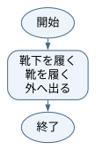
<p class="flow-caption">ひし形は条件判定。「はい」は真、「いいえ」は偽です。矢印の戻り先も確認しましょう。</p>
</div>

</section>

<section class="answer-section">

## 演習1-B　解答・解説

条件で分ける処理は「選択」です。条件は「雨が降っているかどうか」です。条件が「真（成立）」か「偽（不成立）」かで、実行する処理を選びます。

<div class="exercise-flow">
<p class="flow-title">演習1-Bのフローチャート</p>
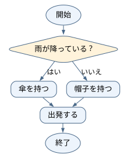
<p class="flow-caption">ひし形は条件判定。「はい」は真、「いいえ」は偽です。矢印の戻り先も確認しましょう。</p>
</div>

</section>

<section class="answer-section">

## 演習1-C　解答・解説

同じ処理を繰り返す「繰返し」です。終了条件は「10枚すべてに押し終わったとき（残り0枚）」です。回数が決まっている場合と、条件を満たすまで続ける場合があります。

<div class="exercise-flow">
<p class="flow-title">演習1-Cのフローチャート</p>
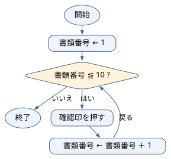
<p class="flow-caption">ひし形は条件判定。「はい」は真、「いいえ」は偽です。矢印の戻り先も確認しましょう。</p>
</div>

</section>

<section class="answer-section">

## 演習1-D　解答・解説

「いい感じ」では基準（小さい順か大きい順か）や終了地点が曖昧だからです。アルゴリズムには明確で誰が見ても同じ結果になる具体的な手順が必要です。

<div class="exercise-flow">
<p class="flow-title">演習1-Dのフローチャート</p>
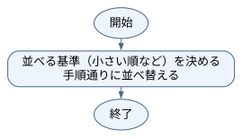
<p class="flow-caption">ひし形は条件判定。「はい」は真、「いいえ」は偽です。矢印の戻り先も確認しましょう。</p>
</div>

</section>

<section class="answer-section">

## 演習1-E　解答・解説

変数は計算結果や入力された値を一時的に覚えておく「名前付きの箱」です。代入「←」は等しいという意味ではなく、「右辺の計算結果を左辺の箱へ入れる」という動作を表します。

<div class="exercise-flow">
<p class="flow-title">演習1-Eのフローチャート</p>
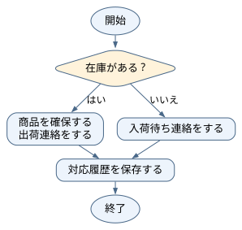
<p class="flow-caption">ひし形は条件判定。「はい」は真、「いいえ」は偽です。矢印の戻り先も確認しましょう。</p>
</div>

</section>

<section class="answer-section">

## 演習1-F　解答・解説

三つすべてが含まれています。答案を1枚ずつ確認する「繰返し」の中に、点数で印を分ける「選択」があり、一連の作業は上から順に進む「順次」で行われます。

<div class="exercise-flow">
<p class="flow-title">演習1-Fのフローチャート</p>
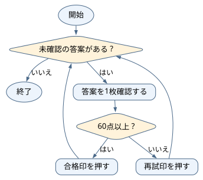
<p class="flow-caption">ひし形は条件判定。「はい」は真、「いいえ」は偽です。矢印の戻り先も確認しましょう。</p>
</div>

</section>

<section class="answer-section">

## 演習2-A　解答・解説

値は2→5→10です。右辺を現在の値で計算してから、左辺を上書きします。

### 値の確認（各処理の実行後）

| 実行した処理 | その直後の値 |
|---|---|
| total ← 2 | total＝2 |
| total ← total ＋ 3 | total＝5 |
| total ← total × 2 | total＝10 |

<div class="exercise-flow">
<p class="flow-title">演習2-Aのフローチャート</p>
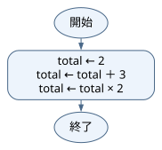
<p class="flow-caption">ひし形は条件判定。「はい」は真、「いいえ」は偽です。矢印の戻り先も確認しましょう。問題で与えられる入力を使い、空欄があれば埋めた処理を示しています。</p>
</div>

</section>

<section class="answer-section">

## 演習2-B　解答・解説

① x、② y、③ temp。tempに元のxを残すので、xを上書きしても7を取り戻せます。最終値はx＝12、y＝7です。

### 値の確認（各処理の実行後）

| 実行した処理 | その直後の値 |
|---|---|
| x ← 7 | x＝7 |
| y ← 12 | x＝7、y＝12 |
| temp ← x | x＝7、y＝12、temp＝7 |
| x ← y | x＝12、y＝12、temp＝7 |
| y ← temp | x＝12、y＝7、temp＝7 |

<div class="exercise-flow">
<p class="flow-title">演習2-Bのフローチャート</p>
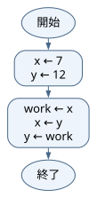
<p class="flow-caption">ひし形は条件判定。「はい」は真、「いいえ」は偽です。矢印の戻り先も確認しましょう。問題で与えられる入力を使い、空欄があれば埋めた処理を示しています。</p>
</div>

</section>

<section class="answer-section">

## 演習2-C　解答・解説

a＝10、b＝14。bへコピーした4は、aを10に変えても自動では変わりません。最後に4＋10を計算します。

### 値の確認（各処理の実行後）

| 実行した処理 | その直後の値 |
|---|---|
| a ← 4 | a＝4 |
| b ← a | a＝4、b＝4 |
| a ← a ＋ 6 | a＝10、b＝4 |
| b ← b ＋ a | a＝10、b＝14 |

<div class="exercise-flow">
<p class="flow-title">演習2-Cのフローチャート</p>
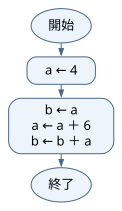
<p class="flow-caption">ひし形は条件判定。「はい」は真、「いいえ」は偽です。矢印の戻り先も確認しましょう。</p>
</div>

</section>

<section class="answer-section">

## 演習2-D　解答・解説

discount＝250、price＝1000です。0.2を掛けると元の金額の20％になります。割引額と支払金額を区別します。

### 値の確認（各処理の実行後）

| 実行した処理 | その直後の値 |
|---|---|
| price ← 1250 | price＝1250 |
| rate ← 0.2 | price＝1250、rate＝0.2 |
| discount ← price × rate | price＝1250、rate＝0.2、discount＝250 |
| price ← price − discount | price＝1000、rate＝0.2、discount＝250 |

<div class="exercise-flow">
<p class="flow-title">演習2-Dのフローチャート</p>
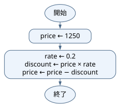
<p class="flow-caption">ひし形は条件判定。「はい」は真、「いいえ」は偽です。矢印の戻り先も確認しましょう。</p>
</div>

</section>

<section class="answer-section">

## 演習2-E　解答・解説

a＝3800、b＝3200、total＝7000。口座aから1200を引き、口座bへ1200を足すため、2口座の合計は移動前（7000）と同じです。

### 値の確認（各処理の実行後）

| 実行した処理 | その直後の値 |
|---|---|
| a ← 5000 | a＝5000 |
| b ← 2000 | a＝5000、b＝2000 |
| amount ← 1200 | a＝5000、b＝2000、amount＝1200 |
| a ← a − amount | a＝3800、b＝2000、amount＝1200 |
| b ← b ＋ amount | a＝3800、b＝3200、amount＝1200 |
| total ← a ＋ b | a＝3800、b＝3200、amount＝1200、total＝7000 |

<div class="exercise-flow">
<p class="flow-title">演習2-Eのフローチャート</p>
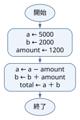
<p class="flow-caption">ひし形は条件判定。「はい」は真、「いいえ」は偽です。矢印の戻り先も確認しましょう。</p>
</div>

</section>

<section class="answer-section">

## 演習2-F　解答・解説

a＝20、b＝30、c＝10です。一時変数tempにaの元値10を退避し、aにbの値20、bにcの値30、cにtempの値10を代入します。

### 値の確認（各処理の実行後）

| 実行した処理 | その直後の値 |
|---|---|
| a ← 10 | a＝10 |
| b ← 20 | a＝10、b＝20 |
| c ← 30 | a＝10、b＝20、c＝30 |
| temp ← a | a＝10、b＝20、c＝30、temp＝10 |
| a ← b | a＝20、b＝20、c＝30、temp＝10 |
| b ← c | a＝20、b＝30、c＝30、temp＝10 |
| c ← temp | a＝20、b＝30、c＝10、temp＝10 |

<div class="exercise-flow">
<p class="flow-title">演習2-Fのフローチャート</p>
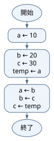
<p class="flow-caption">ひし形は条件判定。「はい」は真、「いいえ」は偽です。矢印の戻り先も確認しましょう。</p>
</div>

公開問題への接続：[変数の退避と上書き](https://www.fe-siken.com/kakomon/sample/b1.html)。本演習は研修用のオリジナル問題であり、リンク先の問題・正解と同一ではありません。

</section>

<section class="answer-section">

## 演習3-A　解答・解説

①150、②80、③apple × 3 ＋ orange × 4。450＋320＝770円です。

### 値の確認（各処理の実行後）

| 実行した処理 | その直後の値 |
|---|---|
| apple ← 150 | apple＝150 |
| orange ← 80 | apple＝150、orange＝80 |
| total ← apple × 3 ＋ orange × 4 | apple＝150、orange＝80、total＝770 |

<div class="exercise-flow">
<p class="flow-title">演習3-Aのフローチャート</p>
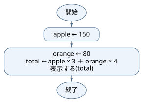
<p class="flow-caption">ひし形は条件判定。「はい」は真、「いいえ」は偽です。矢印の戻り先も確認しましょう。問題で与えられる入力を使い、空欄があれば埋めた処理を示しています。</p>
</div>

</section>

<section class="answer-section">

## 演習3-B　解答・解説

taxIncluded ← price × (1 ＋ rate)、表示する(taxIncluded)。税込価格は1320です。税額120だけでなく、本体価格1200も含めます。

### 値の確認（各処理の実行後）

| 実行した処理 | その直後の値 |
|---|---|
| price ← 1200 | price＝1200 |
| rate ← 0.1 | price＝1200、rate＝0.1 |
| taxIncluded ← price × (1 ＋ rate) | price＝1200、rate＝0.1、taxIncluded＝1320 |

<div class="exercise-flow">
<p class="flow-title">演習3-Bのフローチャート</p>
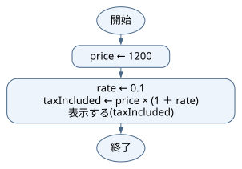
<p class="flow-caption">ひし形は条件判定。「はい」は真、「いいえ」は偽です。矢印の戻り先も確認しましょう。問題で与えられる入力を使い、空欄があれば埋めた処理を示しています。</p>
</div>

</section>

<section class="answer-section">

## 演習3-C　解答・解説

表示は600。入力は単価と個数、処理は掛け算、出力は合計金額の表示です。

### 値の確認（各処理の実行後）

| 実行した処理 | その直後の値 |
|---|---|
| price ← 200 | price＝200 |
| quantity ← 3 | price＝200、quantity＝3 |
| total ← price × quantity | price＝200、quantity＝3、total＝600 |

<div class="exercise-flow">
<p class="flow-title">演習3-Cのフローチャート</p>
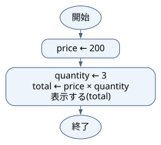
<p class="flow-caption">ひし形は条件判定。「はい」は真、「いいえ」は偽です。矢印の戻り先も確認しましょう。</p>
</div>

</section>

<section class="answer-section">

## 演習3-D　解答・解説

price＝2100。先に送料を足すと2300 × 0.9＝2070です。後者では送料まで割引対象になるため30円違います。

### 値の確認（各処理の実行後）

| 実行した処理 | その直後の値 |
|---|---|
| price ← 2000 | price＝2000 |
| price ← price × 0.9 | price＝1800 |
| price ← price ＋ 300 | price＝2100 |

<div class="exercise-flow">
<p class="flow-title">演習3-Dのフローチャート</p>
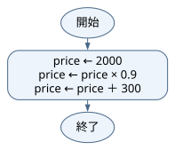
<p class="flow-caption">ひし形は条件判定。「はい」は真、「いいえ」は偽です。矢印の戻り先も確認しましょう。</p>
</div>

</section>

<section class="answer-section">

## 演習3-E　解答・解説

**正解：イ**

製造時間（quantity × perItem）に全体の準備時間（setup）を加えるため [ a ] は quantity × perItem ＋ setup です。分から時間への換算は60で割るため [ b ] は minutes ÷ 60 です（minutes＝138、hours＝2.3）。

### 値の確認（各処理の実行後）

| 実行した処理 | その直後の値 |
|---|---|
| quantity ← 18 | quantity＝18 |
| perItem ← 7 | quantity＝18、perItem＝7 |
| setup ← 12 | quantity＝18、perItem＝7、setup＝12 |
| minutes ← quantity × perItem ＋ setup | quantity＝18、perItem＝7、setup＝12、minutes＝138 |
| hours ← minutes ÷ 60 | quantity＝18、perItem＝7、setup＝12、minutes＝138、hours＝2.3 |

<div class="exercise-flow">
<p class="flow-title">演習3-Eのフローチャート</p>
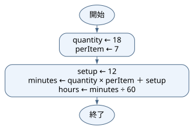
<p class="flow-caption">ひし形は条件判定。「はい」は真、「いいえ」は偽です。矢印の戻り先も確認しましょう。</p>
</div>

</section>

<section class="answer-section">

## 演習3-F　解答・解説

**正解：エ**

入荷時は現在在庫に加算するため [ a ] は stock ＋ received（55個）、出荷時は減算するため [ b ] は stock − shipped（32個）です。不足数は50−32＝18個となります。

### 値の確認（各処理の実行後）

| 実行した処理 | その直後の値 |
|---|---|
| stock ← 40 | stock＝40 |
| received ← 15 | stock＝40、received＝15 |
| shipped ← 23 | stock＝40、received＝15、shipped＝23 |
| stock ← stock ＋ received | stock＝55、received＝15、shipped＝23 |
| stock ← stock − shipped | stock＝32、received＝15、shipped＝23 |
| shortage ← 50 − stock | stock＝32、received＝15、shipped＝23、shortage＝18 |

<div class="exercise-flow">
<p class="flow-title">演習3-Fのフローチャート</p>
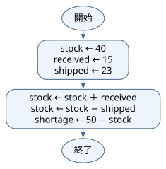
<p class="flow-caption">ひし形は条件判定。「はい」は真、「いいえ」は偽です。矢印の戻り先も確認しましょう。</p>
</div>

</section>

<section class="answer-section">

## 演習4-A　解答・解説

条件はx mod 2 ＝ 0です。余りが0の側だけが偶数になります。x＝8なら偶数、x＝7なら奇数です。

表の確認に使う入力：x＝8。

<div class="exercise-flow">
<p class="flow-title">演習4-Aのフローチャート</p>
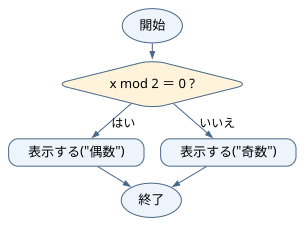
<p class="flow-caption">ひし形は条件判定。「はい」は真、「いいえ」は偽です。矢印の戻り先も確認しましょう。問題で与えられる入力を使い、空欄があれば埋めた処理を示しています。</p>
</div>

</section>

<section class="answer-section">

## 演習4-B　解答・解説

① bmi ＜ 18.5、② bmi ＜ 25。18.49は低体重、18.50と24.99は標準体重、25.00は肥満です。二つ目へ来た時点で18.5以上は確定しています。

表の確認に使う入力：height＝1、weight＝18.5。

### 値の確認（各処理の実行後）

| 実行した処理 | その直後の値 |
|---|---|
| bmi ← weight ÷ (height × height) | bmi＝18.5 |
| result ← "標準体重" | bmi＝18.5、result＝標準体重 |

<div class="exercise-flow">
<p class="flow-title">演習4-Bのフローチャート</p>
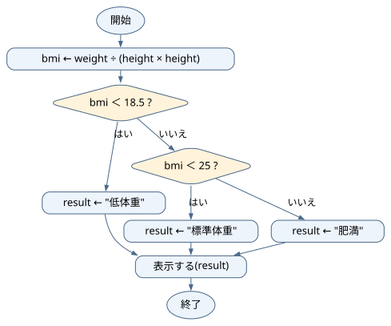
<p class="flow-caption">ひし形は条件判定。「はい」は真、「いいえ」は偽です。矢印の戻り先も確認しましょう。問題で与えられる入力を使い、空欄があれば埋めた処理を示しています。</p>
</div>

</section>

<section class="answer-section">

## 演習4-C　解答・解説

59は再挑戦、60は合格です。「以上」は境目の60自身も含みます。

表の確認に使う入力：score＝59。

### 値の確認（各処理の実行後）

| 実行した処理 | その直後の値 |
|---|---|
| result ← "再挑戦" | result＝再挑戦 |

<div class="exercise-flow">
<p class="flow-title">演習4-Cのフローチャート</p>

<p class="flow-caption">ひし形は条件判定。「はい」は真、「いいえ」は偽です。矢印の戻り先も確認しましょう。</p>
</div>

</section>

<section class="answer-section">

## 演習4-D　解答・解説

順に入場可、入場不可、入場不可です。andは両方が真のときだけ真になります。

表の確認に使う入力：age＝12、hasTicket＝1。

### 値の確認（各処理の実行後）

| 実行した処理 | その直後の値 |
|---|---|
| result ← "入場可" | result＝入場可 |

<div class="exercise-flow">
<p class="flow-title">演習4-Dのフローチャート</p>
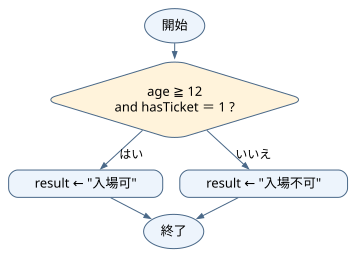
<p class="flow-caption">ひし形は条件判定。「はい」は真、「いいえ」は偽です。矢印の戻り先も確認しましょう。</p>
</div>

</section>

<section class="answer-section">

## 演習4-E　解答・解説

**正解：ア**

「6歳未満」は6を含まないため [ a ] は age ＜ 6 です。最初の条件が偽なら6歳以上と確定しているため、続く条件 [ b ] は age ＜ 18 で6歳以上18歳未満を過不足なく判定できます。

表の確認に使う入力：age＝5。

### 値の確認（各処理の実行後）

| 実行した処理 | その直後の値 |
|---|---|
| fee ← 0 | fee＝0 |

<div class="exercise-flow">
<p class="flow-title">演習4-Eのフローチャート</p>
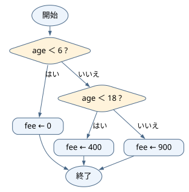
<p class="flow-caption">ひし形は条件判定。「はい」は真、「いいえ」は偽です。矢印の戻り先も確認しましょう。</p>
</div>

公開問題への接続：[条件分岐の読み取り](https://www.fe-siken.com/kakomon/sample/b2.html)。本演習は研修用のオリジナル問題であり、リンク先の問題・正解と同一ではありません。

</section>

<section class="answer-section">

## 演習4-F　解答・解説

**正解：ウ**

冷蔵条件（cold ＝ 1）を最優先で600円とし、次に通常便の中で5000円以上（amount ≧ 5000）を無料と判定します。先に購入額を判定すると冷蔵便まで無料にしてしまうため順序が重要です。

表の確認に使う入力：cold＝1、amount＝6000。

### 値の確認（各処理の実行後）

| 実行した処理 | その直後の値 |
|---|---|
| fee ← 600 | fee＝600 |

<div class="exercise-flow">
<p class="flow-title">演習4-Fのフローチャート</p>
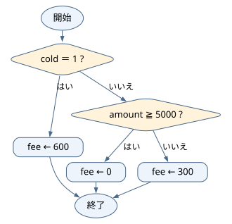
<p class="flow-caption">ひし形は条件判定。「はい」は真、「いいえ」は偽です。矢印の戻り先も確認しましょう。</p>
</div>

</section>

<section class="answer-section">

## 演習5-A　解答・解説

①0、②1、③10、④total ＋ i、⑤total ÷ 10。合計55、平均5.5です。図はforを初期化・条件判定・更新に分解しています。

### 値の確認（各処理の実行後）

| 実行した処理 | その直後の値 |
|---|---|
| total ← 0 | total＝0 |
| i＝1の回を終了 | total＝1、i＝1 |
| i＝2の回を終了 | total＝3、i＝2 |
| …（中間の反復を省略） |  |
| i＝9の回を終了 | total＝45、i＝9 |
| i＝10の回を終了 | total＝55、i＝10 |
| average ← total ÷ 10 | total＝55、i＝11、average＝5.5 |

<div class="exercise-flow">
<p class="flow-title">演習5-Aのフローチャート</p>
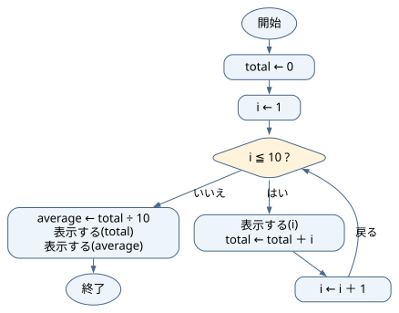
<p class="flow-caption">ひし形は条件判定。「はい」は真、「いいえ」は偽です。矢印の戻り先も確認しましょう。問題で与えられる入力を使い、空欄があれば埋めた処理を示しています。</p>
</div>

</section>

<section class="answer-section">

## 演習5-B　解答・解説

処理①は5回、処理②はi＝1、3、5の3回。終了時i＝6です。i≦5の判定自体は、最後の偽を含め6回行います。

### 値の確認（各処理の実行後）

| 実行した処理 | その直後の値 |
|---|---|
| i ← 1 | i＝1 |
| 繰返し一回分を終了 | i＝2 |
| 繰返し一回分を終了 | i＝3 |
| 繰返し一回分を終了 | i＝4 |
| 繰返し一回分を終了 | i＝5 |
| 繰返し一回分を終了 | i＝6 |

<div class="exercise-flow">
<p class="flow-title">演習5-Bのフローチャート</p>
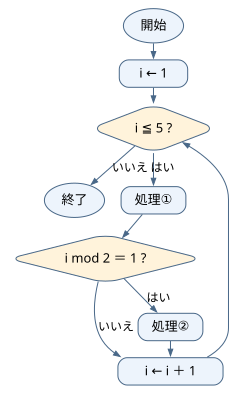
<p class="flow-caption">ひし形は条件判定。「はい」は真、「いいえ」は偽です。矢印の戻り先も確認しましょう。問題で与えられる入力を使い、空欄があれば埋めた処理を示しています。</p>
</div>

</section>

<section class="answer-section">

## 演習5-C　解答・解説

totalは0→2→4→6です。i＝1、2、3の計3回、2を足します。

### 値の確認（各処理の実行後）

| 実行した処理 | その直後の値 |
|---|---|
| total ← 0 | total＝0 |
| i＝1の回を終了 | total＝2、i＝1 |
| i＝2の回を終了 | total＝4、i＝2 |
| i＝3の回を終了 | total＝6、i＝3 |

<div class="exercise-flow">
<p class="flow-title">演習5-Cのフローチャート</p>

<p class="flow-caption">ひし形は条件判定。「はい」は真、「いいえ」は偽です。矢印の戻り先も確認しましょう。</p>
</div>

</section>

<section class="answer-section">

## 演習5-D　解答・解説

表示は5、内部は0回です。whileは、実行する前に条件を確かめます。最初から偽なら一度も入りません。

### 値の確認（各処理の実行後）

| 実行した処理 | その直後の値 |
|---|---|
| i ← 5 | i＝5 |

<div class="exercise-flow">
<p class="flow-title">演習5-Dのフローチャート</p>
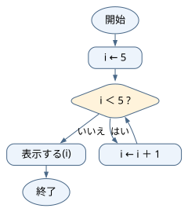
<p class="flow-caption">ひし形は条件判定。「はい」は真、「いいえ」は偽です。矢印の戻り先も確認しましょう。</p>
</div>

</section>

<section class="answer-section">

## 演習5-E　解答・解説

**正解：イ**

目標の3000円に達するまで（未満の間）繰り返すため [ a ] は balance ＜ 3000 です。月数を1ずつ加算するため [ b ] は months ＋ 1 です（終了時: 3か月、3100円）。

### 値の確認（各処理の実行後）

| 実行した処理 | その直後の値 |
|---|---|
| balance ← 1000 | balance＝1000 |
| 繰返し一回分を終了 | balance＝1700、months＝1 |
| 繰返し一回分を終了 | balance＝2400、months＝2 |
| 繰返し一回分を終了 | balance＝3100、months＝3 |

<div class="exercise-flow">
<p class="flow-title">演習5-Eのフローチャート</p>
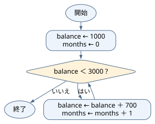
<p class="flow-caption">ひし形は条件判定。「はい」は真、「いいえ」は偽です。矢印の戻り先も確認しましょう。</p>
</div>

</section>

<section class="answer-section">

## 演習5-F　解答・解説

**正解：エ**

毎回の通常処理時間2分を加算するため [ a ] は minutes ＋ 2 です。番号が3の倍数の伝票を判定するため [ b ] は i mod 3 ＝ 0 です（合計22分）。

### 値の確認（各処理の実行後）

| 実行した処理 | その直後の値 |
|---|---|
| minutes ← 0 | minutes＝0 |
| i＝1の回を終了 | minutes＝2、i＝1 |
| i＝2の回を終了 | minutes＝4、i＝2 |
| i＝3の回を終了 | minutes＝11、i＝3 |
| i＝4の回を終了 | minutes＝13、i＝4 |
| i＝5の回を終了 | minutes＝15、i＝5 |
| i＝6の回を終了 | minutes＝22、i＝6 |

<div class="exercise-flow">
<p class="flow-title">演習5-Fのフローチャート</p>
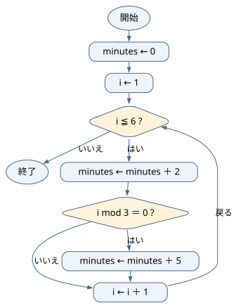
<p class="flow-caption">ひし形は条件判定。「はい」は真、「いいえ」は偽です。矢印の戻り先も確認しましょう。</p>
</div>

</section>

<section class="answer-section">

## 演習6-A　解答・解説

①0、②1、③10、④total ＋ A[i]。iは位置、A[i]はその位置の値です。例えばAが1〜10なら合計55。実際の合計は与えられた配列で変わります。

表の確認に使う入力：A＝{1,2,3,4,5,6,7,8,9,10}。

### 値の確認（各処理の実行後）

| 実行した処理 | その直後の値 |
|---|---|
| total ← 0 | total＝0 |
| i＝1の回を終了 | total＝1、i＝1 |
| i＝2の回を終了 | total＝3、i＝2 |
| …（中間の反復を省略） |  |
| i＝8の回を終了 | total＝36、i＝8 |
| i＝9の回を終了 | total＝45、i＝9 |
| i＝10の回を終了 | total＝55、i＝10 |

<div class="exercise-flow">
<p class="flow-title">演習6-Aのフローチャート</p>
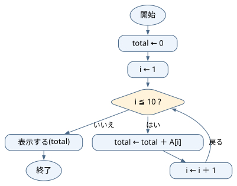
<p class="flow-caption">ひし形は条件判定。「はい」は真、「いいえ」は偽です。矢印の戻り先も確認しましょう。問題で与えられる入力を使い、空欄があれば埋めた処理を示しています。</p>
</div>

</section>

<section class="answer-section">

## 演習6-B　解答・解説

maxは初期値2から、5→5→9→9→10→10→10→10→10。現在の最大値より大きい場合だけ更新します。

表の確認に使う入力：A＝{2,5,1,9,8,10,7,3,6,4}。

### 値の確認（各処理の実行後）

| 実行した処理 | その直後の値 |
|---|---|
| max ← A[1] | max＝2 |
| i＝2の回を終了 | max＝5、i＝2 |
| i＝3の回を終了 | max＝5、i＝3 |
| …（中間の反復を省略） |  |
| i＝8の回を終了 | max＝10、i＝8 |
| i＝9の回を終了 | max＝10、i＝9 |
| i＝10の回を終了 | max＝10、i＝10 |

<div class="exercise-flow">
<p class="flow-title">演習6-Bのフローチャート</p>
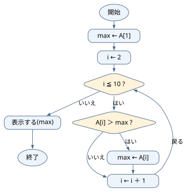
<p class="flow-caption">ひし形は条件判定。「はい」は真、「いいえ」は偽です。矢印の戻り先も確認しましょう。問題で与えられる入力を使い、空欄があれば埋めた処理を示しています。</p>
</div>

</section>

<section class="answer-section">

## 演習6-C　解答・解説

x＝3、A＝{3,3,6}です。A[2]の2は値ではなく位置を指定しています。

表の確認に使う入力：A＝{8,3,6}。

### 値の確認（各処理の実行後）

| 実行した処理 | その直後の値 |
|---|---|
| x ← A[2] | A＝{8, 3, 6}、x＝3 |
| A[1] ← x | A＝{3, 3, 6}、x＝3 |

<div class="exercise-flow">
<p class="flow-title">演習6-Cのフローチャート</p>
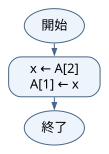
<p class="flow-caption">ひし形は条件判定。「はい」は真、「いいえ」は偽です。矢印の戻り先も確認しましょう。</p>
</div>

</section>

<section class="answer-section">

## 演習6-D　解答・解説

4、7、2の順です。表示するのは添字1、2、3ではなく、その位置に入っている値です。

表の確認に使う入力：A＝{4,7,2}。

### 値の確認（各処理の実行後）

| 実行した処理 | その直後の値 |
|---|---|
| i＝1の回を終了 | i＝1 |
| i＝2の回を終了 | i＝2 |
| i＝3の回を終了 | i＝3 |

<div class="exercise-flow">
<p class="flow-title">演習6-Dのフローチャート</p>
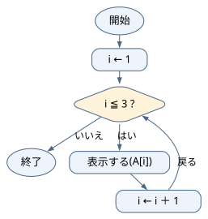
<p class="flow-caption">ひし形は条件判定。「はい」は真、「いいえ」は偽です。矢印の戻り先も確認しましょう。</p>
</div>

</section>

<section class="answer-section">

## 演習6-E　解答・解説

**正解：ア**

目標の5個未満である商品を判定するため [ a ] は A[i] ＜ 5 です（5個ちょうどの商品は不足していません）。不足商品の種類数を1増やすため [ b ] は count ＋ 1 です（count＝2、needed＝8）。

表の確認に使う入力：A＝{2,8,0,5}。

### 値の確認（各処理の実行後）

| 実行した処理 | その直後の値 |
|---|---|
| count ← 0 | count＝0 |
| i＝1の回を終了 | count＝1、needed＝3、i＝1 |
| i＝2の回を終了 | count＝1、needed＝3、i＝2 |
| i＝3の回を終了 | count＝2、needed＝8、i＝3 |
| i＝4の回を終了 | count＝2、needed＝8、i＝4 |

<div class="exercise-flow">
<p class="flow-title">演習6-Eのフローチャート</p>
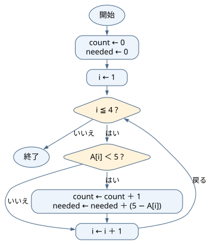
<p class="flow-caption">ひし形は条件判定。「はい」は真、「いいえ」は偽です。矢印の戻り先も確認しましょう。</p>
</div>

</section>

<section class="answer-section">

## 演習6-F　解答・解説

**正解：ウ**

targetと一致し、かつ未発見（position ＝ 0）のときだけ更新することで最初に見つかった位置を保持するため [ a ] は A[i] ＝ target and position ＝ 0 です。位置を記録するため [ b ] は添字の i です。

表の確認に使う入力：A＝{7,4,7,9}、target＝7。

### 値の確認（各処理の実行後）

| 実行した処理 | その直後の値 |
|---|---|
| position ← 0 | position＝0 |
| i＝1の回を終了 | position＝1、i＝1 |
| i＝2の回を終了 | position＝1、i＝2 |
| i＝3の回を終了 | position＝1、i＝3 |
| i＝4の回を終了 | position＝1、i＝4 |

<div class="exercise-flow">
<p class="flow-title">演習6-Fのフローチャート</p>
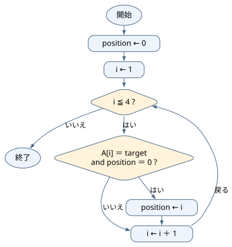
<p class="flow-caption">ひし形は条件判定。「はい」は真、「いいえ」は偽です。矢印の戻り先も確認しましょう。</p>
</div>

公開問題への接続：[探索の考え方（公開問題は二分探索）](https://www.fe-siken.com/kakomon/sample/b13.html)。本演習は研修用のオリジナル問題であり、リンク先の問題・正解と同一ではありません。

</section>

<section class="answer-section">

## 演習7-A　解答・解説

最初の誤りはi＝3の行です。2×3＝6なので、その行のtotalは6。次の行は6×4＝24です。誤った5を使い続けないよう、以降も直します。

### 値の確認（各処理の実行後）

| 実行した処理 | その直後の値 |
|---|---|
| total ← 1 | total＝1 |
| i＝1の回を終了 | total＝1、i＝1 |
| i＝2の回を終了 | total＝2、i＝2 |
| i＝3の回を終了 | total＝6、i＝3 |
| i＝4の回を終了 | total＝24、i＝4 |

<div class="exercise-flow">
<p class="flow-title">演習7-Aのフローチャート</p>
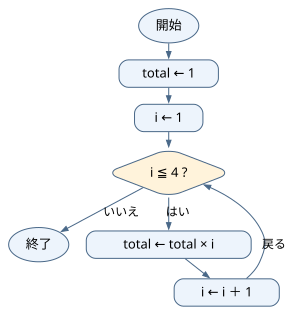
<p class="flow-caption">ひし形は条件判定。「はい」は真、「いいえ」は偽です。矢印の戻り先も確認しましょう。問題で与えられる入力を使い、空欄があれば埋めた処理を示しています。</p>
</div>

</section>

<section class="answer-section">

## 演習7-B　解答・解説

直前は3、直後は7です。右辺で使うxは、代入前の3です。

### 値の確認（各処理の実行後）

| 実行した処理 | その直後の値 |
|---|---|
| x ← 3 | x＝3 |
| x ← x ＋ 4 | x＝7 |

<div class="exercise-flow">
<p class="flow-title">演習7-Bのフローチャート</p>
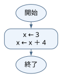
<p class="flow-caption">ひし形は条件判定。「はい」は真、「いいえ」は偽です。矢印の戻り先も確認しましょう。</p>
</div>

</section>

<section class="answer-section">

## 演習7-C　解答・解説

x←2、y←20が実行されます。2＞5は偽なのでy←10は通りません。

### 値の確認（各処理の実行後）

| 実行した処理 | その直後の値 |
|---|---|
| x ← 2 | x＝2 |
| y ← 20 | x＝2、y＝20 |

<div class="exercise-flow">
<p class="flow-title">演習7-Cのフローチャート</p>
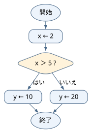
<p class="flow-caption">ひし形は条件判定。「はい」は真、「いいえ」は偽です。矢印の戻り先も確認しましょう。</p>
</div>

</section>

<section class="answer-section">

## 演習7-D　解答・解説

判定時の(i,真偽,total)は(1,真,0)、(2,真,1)、(3,真,3)、(4,偽,6)。終了時i＝4、total＝6です。偽になった行も記録します。

### 値の確認（各処理の実行後）

| 実行した処理 | その直後の値 |
|---|---|
| i ← 1 | i＝1 |
| 繰返し一回分を終了 | i＝2、total＝1 |
| 繰返し一回分を終了 | i＝3、total＝3 |
| 繰返し一回分を終了 | i＝4、total＝6 |

<div class="exercise-flow">
<p class="flow-title">演習7-Dのフローチャート</p>
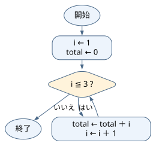
<p class="flow-caption">ひし形は条件判定。「はい」は真、「いいえ」は偽です。矢印の戻り先も確認しましょう。</p>
</div>

</section>

<section class="answer-section">

## 演習7-E　解答・解説

**正解：イ**

「1000円以上」は1000円自身を含むため条件 [ a ] は pay ≧ 1000 です。＞ 1000 にすると1000円の注文が値引きされなくなります。100円引きを行うため [ b ] は pay − 100 です（合計3299円）。

表の確認に使う入力：A＝{999,1000,1500}。

### 値の確認（各処理の実行後）

| 実行した処理 | その直後の値 |
|---|---|
| total ← 0 | total＝0 |
| i＝1の回を終了 | total＝999、i＝1、pay＝999 |
| i＝2の回を終了 | total＝1899、i＝2、pay＝900 |
| i＝3の回を終了 | total＝3299、i＝3、pay＝1400 |

<div class="exercise-flow">
<p class="flow-title">演習7-Eのフローチャート</p>
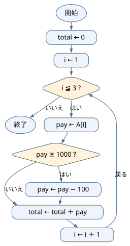
<p class="flow-caption">ひし形は条件判定。「はい」は真、「いいえ」は偽です。矢印の戻り先も確認しましょう。</p>
</div>

</section>

<section class="answer-section">

## 演習7-F　解答・解説

**正解：エ**

直前の要素と値が異なる場合に新しいグループとなるため条件 [ a ] は A[i] ≠ A[i − 1] です。グループ数を1増やすため [ b ] は groups ＋ 1 です（groups＝3）。

表の確認に使う入力：A＝{2,2,5,5,2}。

### 値の確認（各処理の実行後）

| 実行した処理 | その直後の値 |
|---|---|
| groups ← 1 | groups＝1 |
| i＝2の回を終了 | groups＝1、i＝2 |
| i＝3の回を終了 | groups＝2、i＝3 |
| i＝4の回を終了 | groups＝2、i＝4 |
| i＝5の回を終了 | groups＝3、i＝5 |

<div class="exercise-flow">
<p class="flow-title">演習7-Fのフローチャート</p>
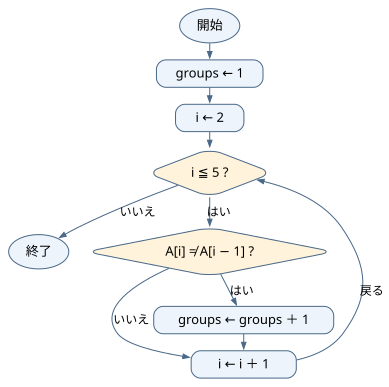
<p class="flow-caption">ひし形は条件判定。「はい」は真、「いいえ」は偽です。矢印の戻り先も確認しましょう。</p>
</div>

公開問題への接続：[配列を一行ずつ追う練習](https://www.fe-siken.com/kakomon/sample/b3.html)。本演習は研修用のオリジナル問題であり、リンク先の問題・正解と同一ではありません。

</section>

<section class="answer-section">

## 演習8-A　解答・解説

①0、②A[i] ≧ 5、③count ← count ＋ 1。条件が真のときだけ1を足します。5自身も対象です。例えばAが1〜10なら6件になります。

表の確認に使う入力：A＝{1,2,3,4,5,6,7,8,9,10}。

### 値の確認（各処理の実行後）

| 実行した処理 | その直後の値 |
|---|---|
| count ← 0 | count＝0 |
| i＝1の回を終了 | count＝0、i＝1 |
| i＝2の回を終了 | count＝0、i＝2 |
| …（中間の反復を省略） |  |
| i＝8の回を終了 | count＝4、i＝8 |
| i＝9の回を終了 | count＝5、i＝9 |
| i＝10の回を終了 | count＝6、i＝10 |

<div class="exercise-flow">
<p class="flow-title">演習8-Aのフローチャート</p>
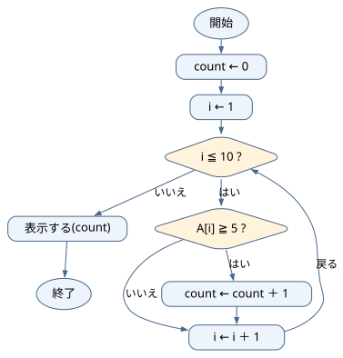
<p class="flow-caption">ひし形は条件判定。「はい」は真、「いいえ」は偽です。矢印の戻り先も確認しましょう。問題で与えられる入力を使い、空欄があれば埋めた処理を示しています。</p>
</div>

</section>

<section class="answer-section">

## 演習8-B　解答・解説

**正解：ア**

①A[i] ＞ max、②A[i]、③i。最大値と位置を一緒に更新します。＞を使うため同点では更新されず、最初の位置が残ります。A＝{4,9,9}ならmax＝9、maxIndex＝2です。

表の確認に使う入力：A＝{4,9,9}。

### 値の確認（各処理の実行後）

| 実行した処理 | その直後の値 |
|---|---|
| max ← A[1] | max＝4 |
| i＝2の回を終了 | max＝9、maxIndex＝2、i＝2 |
| i＝3の回を終了 | max＝9、maxIndex＝2、i＝3 |

<div class="exercise-flow">
<p class="flow-title">演習8-Bのフローチャート</p>
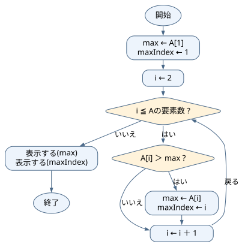
<p class="flow-caption">ひし形は条件判定。「はい」は真、「いいえ」は偽です。矢印の戻り先も確認しましょう。問題で与えられる入力を使い、空欄があれば埋めた処理を示しています。</p>
</div>

公開問題への接続：[配列の位置と上書きに注目する練習](https://www.fe-siken.com/kakomon/08_haru/b1.html)。本演習は研修用のオリジナル問題であり、リンク先の問題・正解と同一ではありません。

</section>

<section class="answer-section">

## 演習8-C　解答・解説

**正解：ウ**

① `i を 1 から num まで 1 ずつ増やす`、② `j を 1 から num まで 1 ずつ増やす`、③ `横に表示する("*")`、④ `改行する()`。外側が行、内側が一行の文字を担当します。改行は内側を終えてから一回だけです。num＝3なら、各行に`***`を表示して3行になります。

表の確認に使う入力：num＝3。

### num＝3の表示結果を確認

| 外側のi | 内側で表示する文字 | 内側を終えた後 |
|---|---|---|
| 1 | *** | 改行する |
| 2 | *** | 改行する |
| 3 | *** | 改行する |

<div class="exercise-flow">
<p class="flow-title">演習8-Cのフローチャート</p>
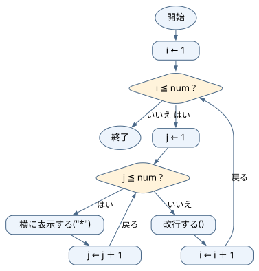
<p class="flow-caption">ひし形は条件判定。「はい」は真、「いいえ」は偽です。矢印の戻り先も確認しましょう。問題で与えられる入力を使い、空欄があれば埋めた処理を示しています。</p>
</div>

</section>

<section class="answer-section">

## 演習8-D　解答・解説

result＝6です。初期値2よりA[2]の6が大きいので更新します。

表の確認に使う入力：A＝{2,6}。

### 値の確認（各処理の実行後）

| 実行した処理 | その直後の値 |
|---|---|
| result ← A[1] | result＝2 |
| result ← A[2] | result＝6 |

<div class="exercise-flow">
<p class="flow-title">演習8-Dのフローチャート</p>
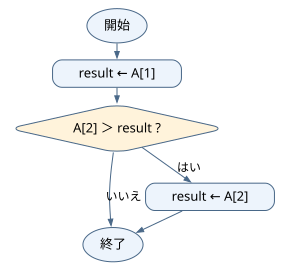
<p class="flow-caption">ひし形は条件判定。「はい」は真、「いいえ」は偽です。矢印の戻り先も確認しましょう。</p>
</div>

</section>

<section class="answer-section">

## 演習8-E　解答・解説

totalは0→3→8です。二つの要素を一回ずつ加算します。

表の確認に使う入力：A＝{3,5}。

### 値の確認（各処理の実行後）

| 実行した処理 | その直後の値 |
|---|---|
| total ← 0 | total＝0 |
| i＝1の回を終了 | total＝3、i＝1 |
| i＝2の回を終了 | total＝8、i＝2 |

<div class="exercise-flow">
<p class="flow-title">演習8-Eのフローチャート</p>
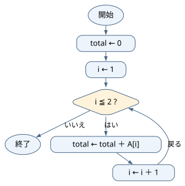
<p class="flow-caption">ひし形は条件判定。「はい」は真、「いいえ」は偽です。矢印の戻り先も確認しましょう。</p>
</div>

</section>

<section class="answer-section">

## 演習8-F　解答・解説

count＝2、total＝13、average＝6.5。対象の8と5だけを足し、配列全体の4個ではなく対象の2個で割ります。

表の確認に使う入力：A＝{3,8,5,1}。

### 値の確認（各処理の実行後）

| 実行した処理 | その直後の値 |
|---|---|
| count ← 0 | count＝0 |
| i＝1の回を終了 | count＝0、total＝0、i＝1 |
| i＝2の回を終了 | count＝1、total＝8、i＝2 |
| i＝3の回を終了 | count＝2、total＝13、i＝3 |
| i＝4の回を終了 | count＝2、total＝13、i＝4 |
| average ← total ÷ count | count＝2、total＝13、i＝5、average＝6.5 |

<div class="exercise-flow">
<p class="flow-title">演習8-Fのフローチャート</p>
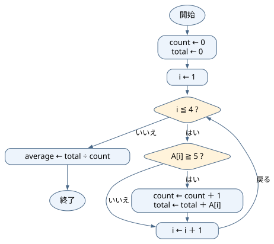
<p class="flow-caption">ひし形は条件判定。「はい」は真、「いいえ」は偽です。矢印の戻り先も確認しましょう。</p>
</div>

</section>

<div class="page-break"></div>

<a id="roadmap"></a>

# 研修後の学習ロードマップ

## 公開問題へ進む前の補助レッスン

公開問題は本教材より長く、まだ学んでいない言葉が登場することがあります。知らない単語だけで止まらず、次の表で読み方を確認します。解けなかった場合は、その知識を補ってから同じ問題へ戻りましょう。

| 新しい言葉・記法 | 初心者向けの意味 |
|---|---|
| 関数 | 名前を付けてまとめた処理。例えば「合計を求める」という一まとまり。 |
| 引数（ひきすう） | 関数へ渡す材料。配列や、探したい値など。 |
| 戻り値・return | 処理の結果として呼出し元へ返す値。画面への表示とは別。returnに到達すると、その関数の処理を終える。 |
| 配列の末尾に追加 | 最後の後ろに新しい要素を一つ増やす。元の末尾の上書きとは違う。 |
| 1ずつ減らすfor | 例えばi＝5、4、3、2の順で処理する。終了値2も処理する。 |
| 昇順 | 小さい値から大きい値へ並んだ状態。 |
| 二分探索 | 並んだ配列の中央と比べ、探す範囲を狭める方法。単に先頭から探す方法とは違い、並び順が前提となる。 |

### 公開問題の読み解き例：配列の要素を移動する

[令和8年度 科目B 問1と解説](https://www.fe-siken.com/kakomon/08_haru/b1.html)を開き、問題文の「末尾を先頭へ」「それ以外は一つ後ろへ」を確認してください。原問題と解答群はリンク先で読みます。以下は同じ処理の考え方を、小さい別の配列で練習するための説明です。

**先に確認：** len（レン）は要素数、top（トップ）は退避用の変数です。data[i − 1]は移動元、data[i]は移動先です。処理中に値を上書きするので、どちらを先に動かすかが重要です。

data＝{4,8,2,6}なら、目標は{6,4,8,2}です。まず最後の6をtopへ保存します。その後、iを4→3→2と減らしながら、一つ前の値を移します。

| 実行した処理 | data | top |
|---|---|---:|
| top ← data[4] | {4,8,2,6} | 6 |
| data[4] ← data[3] | {4,8,2,2} | 6 |
| data[3] ← data[2] | {4,8,8,2} | 6 |
| data[2] ← data[1] | {4,4,8,2} | 6 |
| data[1] ← top | {6,4,8,2} | 6 |

逆にiを2から増やすと、最初にdata[2]を4で上書きします。次に読むdata[2]も既に4なので、元の8を移せません。繰返しの方向は「増やすのが普通」と暗記せず、**これから読む値を先に消していないか**で判断します。原問題に戻り、開始値・終了値・増減の三つが合う選択肢を選びます。

### 配列が増える公開問題の読み方

[サンプル問題 科目B 問3と解説](https://www.fe-siken.com/kakomon/sample/b3.html)では、配列の末尾への追加と、直前までに求めた値の利用を確認します。読む前に「引数が入力」「戻り値が出力」「末尾に追加すると要素数が1増える」を整理してください。

小さい別例で、入力が{2,4,1}なら、先頭からの合計を順に並べると{2,6,7}になります。2を置く→最後の2に4を足して6を追加→最後の6に1を足して7を追加、という順です。「入力配列」と「作成中の出力配列」を別々に表へ書けば、どの配列の最後を読んでいるか混同しにくくなります。

### 難しい探索問題は、前提を学んでから取り組む

[サンプル問題 科目B 問13と解説](https://www.fe-siken.com/kakomon/sample/b13.html)は二分探索の不具合を扱います。第6章の「先頭から探す」練習より先の内容です。まず上の用語表を読み、lowは探索範囲の左端、highは右端、middleは中央の位置を表す変数だと整理します。

例えば二つの値{3,9}から9を探すとき、中央を小さい側の位置1とします。見つからなかったのに左端を再び1にすると、範囲は1〜2のままです。同じ判定を繰り返して終わりません。「繰返した後に範囲が本当に小さくなったか」を、low・high・middleの表で確認します。講師は二分探索の前提を補足してから取り上げてください。

> 公開問題を自習するときの質問例：この公開問題の問題文・コードを提示します。まだ二分探索を習っていません。必要な用語と前提を説明し、要素が二つの例で一回ずつ処理を確認してください。

これらの公開問題は共有PDFに原問題全文を収録していません。リンク先のページは、PDFにURLが書かれているだけではAIが読めるとは限りません。研修で扱う場合は講師が利用条件を確認してソースを準備し、自習では必要な問題文・コードを提示して読み取りを確かめます。本教材の演習1-A〜8-Fは、共有PDF内の問題番号だけで質問できます。

本研修で扱った内容は、科目Bのアルゴリズム問題を読むための入口です。次の順番で学習を続けます。

| 段階 | 学習内容 | 到達目標 |
|---|---|---|
| 1 | 変数・代入・条件分岐・繰返し | 短いコードをトレースできる |
| 2 | 一次元・二次元配列 | 添字と要素を区別できる |
| 3 | 合計・件数・最大・最小 | 基本パターンを説明できる |
| 4 | 線形探索・二分探索 | 探索範囲の変化を追える |
| 5 | 基本的な整列 | 要素の交換を追える |
| 6 | スタック・キュー・リスト | データ構造の操作を理解できる |
| 7 | 再帰・木・グラフ | 呼出しと探索順を追える |
| 8 | 科目B形式の総合問題 | 時間内に必要な値を追える |

## 自習の一週間モデル

| 曜日 | 学習内容 |
|---|---|
| 1日目 | 概念説明を読み、例題をトレースする |
| 2日目 | 基本問題をAIなしで解く |
| 3日目 | 間違えた問題についてAIへ質問する |
| 4日目 | AIが作成した易しい類題を解く |
| 5日目 | 本番形式の問題を時間を測って解く |
| 6日目 | 間違いを「読解・条件・添字・計算・トレース」に分類する |
| 7日目 | AIを使わず、間違えた問題を解き直す |

## 研修後に別のFE参考書で自習する場合

研修用の共有ノートブックは本教材の復習に使えます。別の参考書に進むときは、第0章0.4の方法で新しい問題をAIへ伝えてください。自分で利用権限のあるPDFを別のノートブックへ登録した場合も、教材名と問題番号を添えて対象を明確にします。

> 自習中の参考書『○○』第○版、○ページの問○についてです。問題文とコードを添付します。まず入力条件と求める結果だけを確認してください。私は○行目まで考えました。次の行で使う値が分からないので、答えではなく一つだけヒントをください。

添字の開始番号、配列の内容、関数の仕様、問題が複数ページにまたがる場合の続きも伝えます。AIが別の版や別の問題を説明したら、いったん止め、提供した内容だけで答えるように指定します。

<div class="prompt-card">
  <p class="prompt-title">自習で新しいチャットを始めるときの初回設定例（第0章の手順1）</p>
  <p>登録された教材を優先して回答してください。<br>
  答えを直接示す前に、私がどこまで考えたかを確認してください。<br>
  最初はヒントを一つだけ提示してください。<br>
  擬似言語を説明するときは、変数の変化を表にしてください。<br>
  私の考えに誤りがある場合は、最初の誤りだけを指摘してください。<br>
  教材と異なる説明をする場合は、そのことを明示してください。</p>
</div>

<div class="important-box">
  <p class="box-title">最後は必ずAIなしで解く</p>
  <p>AIの説明を理解できても、本番でAIは使用できません。各単元の最後には、AIを閉じ、問題文と紙だけで同じ問題をもう一度解いてください。</p>
</div>

## 学習記録

| 日付 | 学習範囲 | 自力で解けた問題 | AIへ質問した内容 | 解き直し |
|---|---|---|---|---|
| | | | | □ |
| | | | | □ |
| | | | | □ |
| | | | | □ |

<div class="page-break"></div>

# 参考資料

- [基本情報技術者試験.com「科目B 過去問題」](https://www.fe-siken.com/fekakomon_b.php)（公開問題の所在と解説を確認。教材の48問は研修用オリジナル問題。）
- [Google ヘルプ「ソースの追加」](https://support.google.com/gemininotebook/answer/16215270?hl=ja)
- [Google ヘルプ「ノートブックの共有」](https://support.google.com/gemininotebook/answer/16322204?hl=ja)
- [独立行政法人情報処理推進機構（IPA）「試験要綱・シラバスについて」](https://www.ipa.go.jp/shiken/syllabus/gaiyou.html)
- [独立行政法人情報処理推進機構（IPA）「基本情報技術者試験 科目Bのサンプル問題」](https://www.ipa.go.jp/shiken/syllabus/ps6vr7000000oett-att/fe_kamoku_b_sample.pdf)
- [独立行政法人情報処理推進機構（IPA）「令和8年度 基本情報技術者試験 科目B 公開問題」](https://www.ipa.go.jp/shiken/mondai-kaiotu/sg_fe/koukai/rcu1hd0000012qj6-att/2026r08_fe_kamoku_b_qs.pdf)
- [独立行政法人情報処理推進機構（IPA）「SG・FE 公開問題」](https://www.ipa.go.jp/shiken/mondai-kaiotu/sg_fe/koukai/index.html)

---

本教材の擬似言語は、基本情報技術者試験用の記述形式に合わせています。演習量、難易度、解説の粒度は、研修対象者と実施時間に合わせて調整します。
